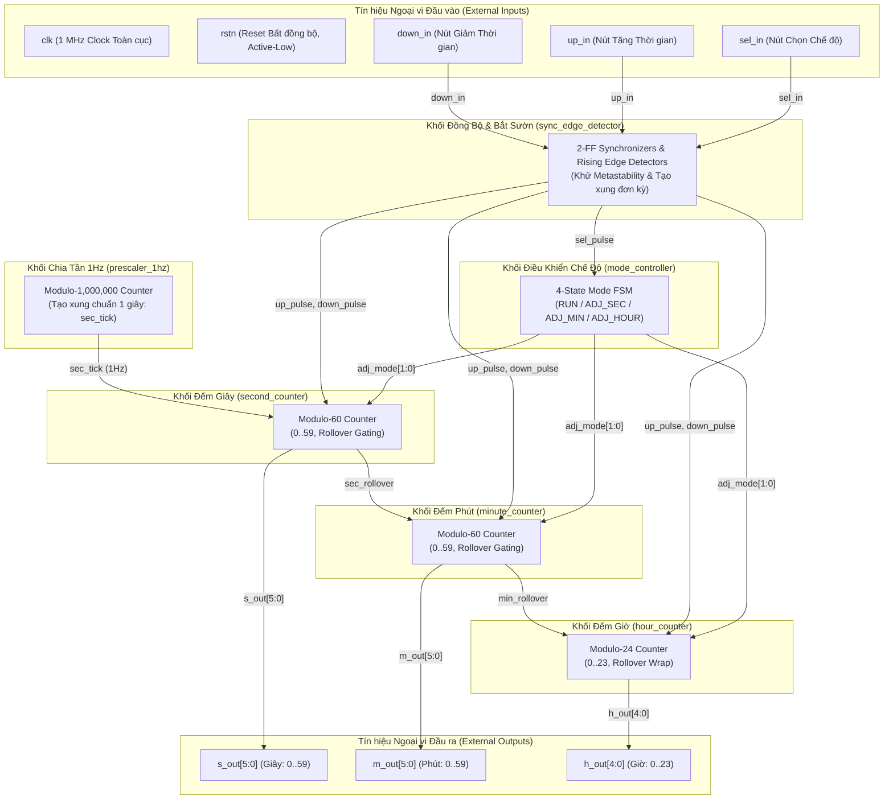

# ĐẶC TẢ THIẾT KẾ KIẾN TRÚC RTL
# BỘ ĐẾM THỜI GIAN GIỜ - PHÚT - GIÂY (HOUR-MINUTE-SECOND TIMER)
## IP CORE: `hms_timer`

---

## THÔNG TIN TÀI LIỆU
- **Tên dự án:** Thiết kế lõi IP Bộ đếm Thời gian Giờ - Phút - Giây (`hms_timer`)
- **Tài liệu tham chiếu:** `week1_Qorvo-HMS_Timer.pdf` (Qorvo Digital Design and Verification)
- **Mã tài liệu:** `SPEC-RTL-HMS-001`
- **Vai trò:** Kỹ sư Trưởng Kiến trúc RTL (Senior Digital IC / RTL Specification Architect)
- **Chuẩn ngôn ngữ:** IEEE 1364-2001 / IEEE 1800 Synthesizable Verilog / SystemVerilog
- **Mục tiêu công nghệ:** Technology-Independent (ASIC Standard Cell / FPGA Xilinx, Intel, Microchip)
- **Trạng thái:** `APPROVED FOR RTL IMPLEMENTATION`
- **Phiên bản:** `1.0.0`
- **Ngày phát hành:** 2026-09-14

---

## MỤC LỤC
1. [CHƯƠNG 1: TỔNG QUAN HỆ THỐNG VÀ KIẾN TRÚC THIẾT KẾ](#chương-1-tổng-quan-hệ-thống-và-kiến-trúc-thiết-kế)
   - 1.1 Tổng quan về thiết kế
   - 1.2 Đặc điểm kiến trúc cốt lõi
   - 1.3 Sơ đồ kiến trúc tổng quan (Architecture Overview)
   - 1.4 Bảng tham số kiến trúc (Design Parameters)
2. [CHƯƠNG 2: TOP MODULE – `hms_timer`](#chương-2-top-module--hms_timer)
   - 2.1 Sơ đồ khối Top Module
   - 2.2 Bảng chân tín hiệu ngoại vi Top Module (External I/O Table)
   - 2.3 Nguyên lý hoạt động tổng thể & Mối quan hệ tương tác giữa các Sub-module
   - 2.4 Bảng kết nối nội bộ giữa các Sub-module (Internal Interconnect Table)
   - 2.5 Giản đồ thời gian tổng thể Top Module (Top-Level Timing Diagram)
3. [CHƯƠNG 3: ĐẶC TẢ CHI TIẾT TỪNG SUB-MODULE](#chương-3-đặc-tả-chi-tiết-từng-sub-module)
   - 3.1 Module: `sync_edge_detector` (Khối Đồng bộ hóa & Bắt sườn tín hiệu vào)
   - 3.2 Module: `prescaler_1hz` (Khối Bộ chia tần số tạo xung 1Hz)
   - 3.3 Module: `mode_controller` (Khối Điều khiển Chế độ & FSM)
   - 3.4 Module: `second_counter` (Khối Bộ đếm Giây Modulo-60)
   - 3.5 Module: `minute_counter` (Khối Bộ đếm Phút Modulo-60)
   - 3.6 Module: `hour_counter` (Khối Bộ đếm Giờ Modulo-24)
4. [CHƯƠNG 4: MA TRẬN TRUY XUẤT YÊU CẦU (RTM) & KẾ HOẠCH KIỂM CHỨNG](#chương-4-ma-trận-truy-xuất-yêu-cầu-rtm--kế-hoạch-kiểm-chứng)
   - 4.1 Phân loại yêu cầu thiết kế (Requirement Classification)
   - 4.2 Ma trận truy xuất yêu cầu kiểm tra (Requirement Traceability Matrix - RTM)
   - 4.3 Kế hoạch kiểm chứng chức năng (Functional Verification Plan)

---

# CHƯƠNG 1: TỔNG QUAN HỆ THỐNG VÀ KIẾN TRÚC THIẾT KẾ

## 1.1 Tổng quan về thiết kế
Hệ thống **Hour-Minute-Second Timer** (`hms_timer`) là một khối IP phần cứng số hoàn chỉnh (Synthesizable RTL IP Core), hoạt động trên một miền xung nhịp đồng bộ duy nhất với tần số đầu vào chuẩn **$1\text{ MHz}$** ($f_{clk} = 1,000,000\text{ Hz}$, chu kỳ $T_{clk} = 1\,\mu\text{s}$) và tín hiệu Reset bất đồng bộ tích cực mức thấp (`rstn`).

Thiết kế có 2 chức năng chính:
1. **Chế độ đếm thời gian thực (Real-Time Counting Mode):** Tự động đếm tăng Giờ ($0 \dots 23$), Phút ($0 \dots 59$), Giây ($0 \dots 59$) theo nhịp thời gian thực chuẩn $1\text{ giây}$ được chia từ xung nhịp $1\text{ MHz}$.
2. **Chế độ điều chỉnh thời gian (Time Adjustment Mode):** Cho phép người dùng lựa chọn điều chỉnh từng trường thời gian (Giây, Phút, Giờ) thông qua nút chọn `sel_in`, và tăng hoặc giảm giá trị tương ứng thông qua 2 nút kích hoạt sườn `up_in` và `down_in`.

## 1.2 Đặc điểm kiến trúc cốt lõi
- **Miền xung nhịp đơn đồng bộ (`Single Synchronous Clock Domain`):** Toàn bộ các thanh ghi (D-FF) trong hệ thống đều được kích hoạt tại sườn dương của xung nhịp `clk` (`posedge clk`). Tuyệt đối không sử dụng ngõ ra của bộ đếm trước làm xung nhịp cho bộ đếm sau (No Ripple Clock).
- **Chống hiện tượng không ổn định trạng thái (`Metastability Immunity`):** Các tín hiệu điều khiển ngoại vi (`sel_in`, `up_in`, `down_in`) là các tín hiệu bất đồng bộ kích sườn được đồng bộ hóa qua chuỗi 2 tầng Flip-Flop (2-FF Synchronizer) trước khi đưa vào bộ phát hiện sườn dương (Rising-Edge Detector) để tạo xung đơn kỳ (`1-clock-cycle pulse`).
- **Lan truyền cờ tràn đồng bộ (`Synchronous Rollover Enable Propagation`):** Các bộ đếm liên kết với nhau bằng tín hiệu cho phép có độ rộng chính xác 1 chu kỳ xung nhịp (`sec_rollover`, `min_rollover`).
- **Khối FSM chuyển chế độ tuần hoàn 4 trạng thái (`4-State Mode FSM`):** `RUN_NORMAL (00)` $\rightarrow$ `ADJ_SEC (01)` $\rightarrow$ `ADJ_MIN (10)` $\rightarrow$ `ADJ_HOUR (11)` $\rightarrow$ `RUN_NORMAL (00)`.
- **Hỗ trợ Wrap-around 2 chiều độc lập:**
  * Giây: $0 \rightarrow 1 \dots 59 \rightarrow 0$ (khi Tăng), $0 \rightarrow 59 \dots 1 \rightarrow 0$ (khi Giảm).
  * Phút: $0 \rightarrow 1 \dots 59 \rightarrow 0$ (khi Tăng), $0 \rightarrow 59 \dots 1 \rightarrow 0$ (khi Giảm).
  * Giờ: $0 \rightarrow 1 \dots 23 \rightarrow 0$ (khi Tăng), $0 \rightarrow 23 \dots 1 \rightarrow 0$ (khi Giảm).
- **Cách ly tràn khi đang điều chỉnh (`Rollover Gating during Adjustment`):** Khi đang ở chế độ chỉnh Giây hoặc chỉnh Phút bằng nút bấm, tín hiệu cờ tràn sang tầng kế tiếp bị khóa về mức `0` để ngăn chặn việc thay đổi sai lệch ngoài ý muốn của tầng trên.

## 1.3 Sơ đồ kiến trúc tổng quan (Architecture Overview)



> [!NOTE]
> - **Miền xung nhịp đơn (`clk`):** Toàn bộ các khối Flip-Flop trong thiết kế đều sử dụng chung xung nhịp hệ thống $1\text{ MHz}$ (`posedge clk`).
> - **Reset bất đồng bộ (`rstn`):** Tín hiệu `rstn` tích cực mức thấp được phân phối đồng thời đến tất cả các sub-module để khởi tạo trạng thái ban đầu.


## 1.4 Bảng tham số kiến trúc (Design Parameters)

| Tên tham số | Giá trị mặc định | Đơn vị | Mô tả chức năng | Phân loại |
| :--- | :---: | :---: | :--- | :---: |
| `CLK_FREQ_HZ` | `1_000_000` | Hz | Tần số xung nhịp hệ thống đầu vào ($1\text{ MHz}$) | USER-PROVIDED |
| `PSC_COUNT_MAX` | `999_999` | Chu kỳ | Giá trị đếm cực đại của Prescaler ($10^6 - 1$) để tạo nhịp $1\text{ Hz}$ | DERIVED |
| `PSC_WIDTH` | `20` | Bit | Độ rộng bit thanh ghi đếm Prescaler ($\lceil\log_2(1_000_000)\rceil = 20$) | DERIVED |
| `SEC_WIDTH` | `6` | Bit | Độ rộng thanh ghi đếm Giây ($0 \dots 59$) | USER-PROVIDED |
| `MIN_WIDTH` | `6` | Bit | Độ rộng thanh ghi đếm Phút ($0 \dots 59$) | USER-PROVIDED |
| `HOUR_WIDTH` | `5` | Bit | Độ rộng thanh ghi đếm Giờ ($0 \dots 23$) | USER-PROVIDED |
| `MODE_WIDTH` | `2` | Bit | Độ rộng trạng thái FSM điều khiển chế độ | DERIVED |

---

# CHƯƠNG 2: TOP MODULE – `hms_timer`

## 2.1 Sơ đồ khối Top Module

```
+========================================================================================+
|                                    TOP: hms_timer                                      |
|                                                                                        |
|                     +---------------------------------------------+                    |
|                     |             sync_edge_detector              |                    |
|                     |                                             |                    |
|   sel_in ---------->| sel_in  --> [2-FF+Edge] --> sel_pulse  ----+|                    |
|   up_in ----------->| up_in   --> [2-FF+Edge] --> up_pulse   ----+|--+                 |
|   down_in --------->| down_in --> [2-FF+Edge] --> down_pulse ----+|--|--+              |
|                     +---------------------------------------------+  |  |              |
|                                                                      |  |  |              |
|                     +---------------------+                          |  |  |              |
|                     |   mode_controller   |                          |  |  |              |
|                     |                     |<-------------------------+  |  |              |
|                     | adj_mode[1:0] ------|---+                         |  |              |
|                     +---------------------+   |                         |  |              |
|                                               |                         |  |              |
|                     +---------------------+   |                         |  |              |
|                     |    prescaler_1hz    |   |                         |  |              |
|                     |                     |   |                         |  |              |
|                     | sec_tick -----------|---|---+                     |  |              |
|                     +---------------------+   |   |                     |  |              |
|                                               |   |                     |  |              |
|                     +---------------------+   |   |                     |  |              |
|                     |   second_counter    |   |   |                     |  |              |
|                     |                     |<--+<--+<--------------------+--+              |
|                     | s_out[5:0] ---------|---|---|-------------------------> s_out[5:0]  |
|                     | sec_rollover -------|---|---|---+                                   |
|                     +---------------------+   |   |   |                                   |
|                                               |   |   |                                   |
|                     +---------------------+   |   |   |                                   |
|                     |   minute_counter    |   |   |   |                                   |
|                     |                     |<--+   |<--+<--------------------+--+          |
|                     | m_out[5:0] ---------|---|---|---|---------------------> m_out[5:0]  |
|                     | min_rollover -------|---|---|---|---+                               |
|                     +---------------------+   |   |   |   |                               |
|                                               |   |   |   |                               |
|                     +---------------------+   |   |   |   |                               |
|                     |    hour_counter     |   |   |   |   |                               |
|                     |                     |<--+   |   |<--+<----------------+--+          |
|                     | h_out[4:0] ---------|---|---|---|---|-----------------> h_out[4:0]  |
|                     +---------------------+   |   |   |   |                               |
|                                                                                        |
|   clk -------------> [Đưa đến tất cả các sub-module đồng bộ]                           |
|   rstn ------------> [Đưa đến tất cả các sub-module reset bất đồng bộ]                 |
+========================================================================================+
```

## 2.2 Bảng chân tín hiệu ngoại vi Top Module (External I/O Table)

| Tên chân tín hiệu | Hướng | Số bit | Loại | Mô tả chức năng chi tiết | Điều kiện hợp lệ | Giá trị Reset (`rstn=0`) | Phân loại |
| :--- | :---: | :---: | :---: | :--- | :--- | :---: | :---: |
| `clk` | Input | 1 | Clock | Xung nhịp hệ thống toàn cục tần số $1\text{ MHz}$ | Chu kỳ ổn định $1\,\mu\text{s}$ | N/A | USER-PROVIDED |
| `rstn` | Input | 1 | Reset | Tín hiệu khởi tạo hệ thống (Bất đồng bộ, tích cực mức thấp - Active-Low) | Mức `0` để reset toàn bộ hệ thống | N/A | USER-PROVIDED |
| `sel_in` | Input | 1 | Control | Tín hiệu chọn chế độ điều chỉnh thời gian (Kích sườn dương - Edge-triggered) | Xung chuyển trạng thái | N/A | USER-PROVIDED |
| `up_in` | Input | 1 | Control | Tín hiệu tăng giá trị thời gian đã chọn (Kích sườn dương - Edge-triggered) | Xung tăng giá trị | N/A | USER-PROVIDED |
| `down_in` | Input | 1 | Control | Tín hiệu giảm giá trị thời gian đã chọn (Kích sườn dương - Edge-triggered) | Xung giảm giá trị | N/A | USER-PROVIDED |
| `h_out` | Output | 5 | Data | Giá trị Giờ thời gian thực hiện tại ($0 \dots 23$) | $0 \le \text{h\_out} \le 23$ | `5'b00000` (`0`) | USER-PROVIDED |
| `m_out` | Output | 6 | Data | Giá trị Phút thời gian thực hiện tại ($0 \dots 59$) | $0 \le \text{m\_out} \le 59$ | `6'b000000` (`0`) | USER-PROVIDED |
| `s_out` | Output | 6 | Data | Giá trị Giây thời gian thực hiện tại ($0 \dots 59$) | $0 \le \text{s\_out} \le 59$ | `6'b000000` (`0`) | USER-PROVIDED |

## 2.3 Nguyên lý hoạt động tổng thể & Mối quan hệ tương tác giữa các Sub-module

### 2.3.1 Cơ chế phân tầng và truyền tín hiệu đồng bộ
1. **Khối bắt sườn & Chống bất đồng bộ (`sync_edge_detector`):** 
   - Tiếp nhận 3 ngõ vào ngoại vi bất đồng bộ `sel_in`, `up_in`, `down_in`.
   - Lọc qua 2 tầng flip-flop đồng bộ trên miền xung nhịp `clk` ($1\text{ MHz}$), triệt tiêu hoàn toàn hiện tượng metastability.
   - Trích xuất sườn dương (0 lên 1) để tạo ra các xung đơn kỳ: `sel_pulse`, `up_pulse`, `down_pulse`.
2. **Khối tạo nhịp cơ sở 1 giây (`prescaler_1hz`):**
   - Bộ đếm 20-bit đếm liên tục từ $0$ đến $999,999$ chu kỳ xung nhịp $1\text{ MHz}$.
   - Khi đạt $999,999$, phát ra đúng 1 xung `sec_tick` có độ rộng 1 chu kỳ clock, sau đó quay về $0$.
3. **Khối điều khiển chế độ (`mode_controller`):**
   - Nhận tín hiệu `sel_pulse` để chuyển trạng thái FSM tuần hoàn:
     - `2'b00 (MODE_RUN)`: Chế độ đếm thời gian thực bình thường.
     - `2'b01 (MODE_ADJ_SEC)`: Chế độ điều chỉnh Giây.
     - `2'b10 (MODE_ADJ_MIN)`: Chế độ điều chỉnh Phút.
     - `2'b11 (MODE_ADJ_HOUR)`: Chế độ điều chỉnh Giờ.
   - Phát mã trạng thái `adj_mode[1:0]` đến 3 bộ đếm thời gian.
4. **Khối đếm Giây (`second_counter`):**
   - Khi ở `MODE_RUN`: Tăng lên 1 sau mỗi xung `sec_tick`. Khi giá trị đang là 59 và có `sec_tick`, giá trị cuộn về 0 (`s_out = 0`) đồng thời phát cờ `sec_rollover = 1` trong đúng 1 chu kỳ xung nhịp.
   - Khi ở `MODE_ADJ_SEC`: Bỏ qua `sec_tick`, lắng nghe `up_pulse` (tăng giây modulo-60, $59 \rightarrow 0$) và `down_pulse` (giảm giây modulo-60, $0 \rightarrow 59$). Cờ `sec_rollover` luôn được chốt ở mức `0` để không ảnh hưởng đến bộ đếm Phút.
5. **Khối đếm Phút (`minute_counter`):**
   - Khi ở `MODE_RUN`: Tăng lên 1 mỗi khi nhận được xung `sec_rollover = 1`. Khi giá trị đang là 59 và có `sec_rollover`, cuộn về 0 (`m_out = 0`) đồng thời phát cờ `min_rollover = 1` trong 1 chu kỳ.
   - Khi ở `MODE_ADJ_MIN`: Bỏ qua `sec_rollover`, lắng nghe `up_pulse` ($59 \rightarrow 0$) và `down_pulse` ($0 \rightarrow 59$). Cờ `min_rollover` luôn bị khóa về `0` để không làm thay đổi Giờ.
6. **Khối đếm Giờ (`hour_counter`):**
   - Khi ở `MODE_RUN`: Tăng lên 1 mỗi khi nhận được xung `min_rollover = 1`. Khi giá trị đang là 23 và có `min_rollover`, cuộn về 0 (`h_out = 0`).
   - Khi ở `MODE_ADJ_HOUR`: Bỏ qua `min_rollover`, lắng nghe `up_pulse` ($23 \rightarrow 0$) và `down_pulse` ($0 \rightarrow 23$).

### 2.3.2 Thứ tự ưu tiên logic (Priority Rules)
1. **Reset bất đồng bộ (`rstn = 0`):** Ưu tiên cao nhất, đưa toàn bộ thanh ghi đếm, FSM và thanh ghi đồng bộ về giá trị 0 ngay lập tức.
2. **Độ ưu tiên nút bấm khi điều chỉnh:** Nếu trong cùng 1 chu kỳ xung nhịp xuất hiện đồng thời cả `up_pulse = 1` và `down_pulse = 1`, hệ thống quy ước giữ nguyên giá trị đếm (`Hold`) để ngăn chặn trạng thái bất định (Race condition).

## 2.4 Bảng kết nối nội bộ giữa các Sub-module (Internal Interconnect Table)

| Tên Net nội bộ | Bit-width | Module Nguồn (Driver) | Module Đích (Receiver) | Mô tả chức năng |
| :--- | :---: | :--- | :--- | :--- |
| `sel_pulse` | 1 | `sync_edge_detector` | `mode_controller` | Xung tích cực 1 chu kỳ khi nhấn nút `sel_in` |
| `up_pulse` | 1 | `sync_edge_detector` | `second_counter`, `minute_counter`, `hour_counter` | Xung tích cực 1 chu kỳ khi nhấn nút `up_in` |
| `down_pulse` | 1 | `sync_edge_detector` | `second_counter`, `minute_counter`, `hour_counter` | Xung tích cực 1 chu kỳ khi nhấn nút `down_in` |
| `sec_tick` | 1 | `prescaler_1hz` | `second_counter` | Xung chuẩn nhịp 1 giây (độ rộng 1 cycle clock) |
| `adj_mode[1:0]` | 2 | `mode_controller` | `second_counter`, `minute_counter`, `hour_counter` | Mã trạng thái chế độ hoạt động hiện tại |
| `sec_rollover` | 1 | `second_counter` | `minute_counter` | Xung tràn Giây (59->0) cho phép tăng Phút |
| `min_rollover` | 1 | `minute_counter` | `hour_counter` | Xung tràn Phút (59->0) cho phép tăng Giờ |

## 2.5 Giản đồ thời gian tổng thể Top Module (Top-Level Timing Diagram)

### Giản đồ 2.5.1: Khởi động Reset & Chế độ Đếm Thời gian Thực (Normal Run Mode)

```
Chu kỳ clk     :  0   1   2   3   4 ... 999999 1000000 ... 59999999 60000000
                 __  __  __  __  __      __      __          __        __
clk            :_| |_| |_| |_| |_| |..._|  |_..._| |_ ...  _|  |_ ..._|  |_
               ____
rstn               |_______________________________________________________
               ------------------------------------------------------------
adj_mode[1:0]  :  2'b00 (MODE_RUN)
                                         __                  __
sec_tick       :________________________|  |________________|  |___________
                                         __
s_out[5:0]     :  0'd0                  | 0'd1              | 6'd59   | 6'd0
                                                             __
sec_rollover   :____________________________________________|  |___________
                                                             __
m_out[5:0]     :  0'd0                                      | 6'd0    | 6'd1
```

### Giản đồ 2.5.2: Chuyển Chế độ Cài đặt & Điều chỉnh Giờ / Phút / Giây

```
Tín hiệu        T0    T1    T2    T3    T4    T5    T6    T7    T8    T9    T10   T11   T12
                __    __    __    __    __    __    __    __    __    __    __    __    __
clk           :_| |_| |_| |_| |_| |_| |_| |_| |_| |_| |_| |_| |_| |_| |_| |_| |_| |_| |_| |_
                      __________________                __________________
sel_in        :______|                  |______________|                  |________________
                            __                                __
sel_pulse     :____________|  |______________________________|  |__________________________
adj_mode[1:0] :  2'b00 (RUN)   | 2'b01 (ADJ_SEC)              | 2'b10 (ADJ_MIN)
                            __________________
up_in         :____________|                  |____________________________________________
                                  __
up_pulse      :__________________|  |______________________________________________________
s_out[5:0]    :  6'd58                 | 6'd59                                              
                                                        __________________
down_in       :________________________________________|                  |________________
                                                              __
down_pulse    :______________________________________________|  |__________________________
m_out[5:0]    :  6'd00                                                | 6'd59 (Wrap-down)
```

---

# CHƯƠNG 3: ĐẶC TẢ CHI TIẾT TỪNG SUB-MODULE

## 3.1 Module: `sync_edge_detector`

### 3.1.1 Sơ đồ khối (Block Diagram)

```
                    +-------------------------------------------------------------+
                    |                     sync_edge_detector                      |
                    |                                                             |
                    |               +--------+    +--------+    +--------+        |
                    |  in_async --->| FF_S1  |--->| FF_S2  |--->| FF_D   |        |
                    |               | (sync) |    | (sync) |    | (edge) |        |
                    |               +--------+    +--------+    +----+---+        |
                    |                                                |            |
                    |                                 FF_S2 ---------+--- AND --->| out_pulse
                    |                                 ~FF_D ---------+    (1 cyc) |
                    |                                                             |
   clk ------------>| [Đưa đến chân clk của tất cả FF]                            |
   rstn ----------->| [Đưa đến chân rstn bất đồng bộ của tất cả FF]               |
                    +-------------------------------------------------------------+
```

### 3.1.2 Bảng chân tín hiệu (I/O Interface Table)

| Tên chân tín hiệu | Hướng | Số bit | Loại | Mô tả chức năng chi tiết | Điều kiện hợp lệ | Giá trị Reset (`rstn=0`) |
| :--- | :---: | :---: | :---: | :--- | :--- | :---: |
| `clk` | Input | 1 | Clock | Xung nhịp hệ thống $1\text{ MHz}$ | Chuẩn | N/A |
| `rstn` | Input | 1 | Reset | Reset hệ thống bất đồng bộ tích cực thấp | Mức `0` | N/A |
| `sel_in` | Input | 1 | Async In | Tín hiệu nút chọn chế độ ngoại vi | Bất kỳ | N/A |
| `up_in` | Input | 1 | Async In | Tín hiệu nút tăng ngoại vi | Bất kỳ | N/A |
| `down_in` | Input | 1 | Async In | Tín hiệu nút giảm ngoại vi | Bất kỳ | N/A |
| `sel_pulse` | Output | 1 | Pulse Out | Xung tích cực mức cao 1 chu kỳ khi phát hiện sườn dương `sel_in` | Đồng bộ `clk` | `1'b0` |
| `up_pulse` | Output | 1 | Pulse Out | Xung tích cực mức cao 1 chu kỳ khi phát hiện sườn dương `up_in` | Đồng bộ `clk` | `1'b0` |
| `down_pulse` | Output | 1 | Pulse Out | Xung tích cực mức cao 1 chu kỳ khi phát hiện sườn dương `down_in` | Đồng bộ `clk` | `1'b0` |

### 3.1.3 Nguyên lý hoạt động (Operating Principle)
- Mỗi tín hiệu ngõ vào bất đồng bộ $X \in \{\text{sel\_in, up\_in, down\_in}\}$ được đưa qua chuỗi 3 Flip-Flop liên tiếp:
  - Tầng 1 ($FF_1$): Khử bất đồng bộ thô.
  - Tầng 2 ($FF_2$): Lấy mẫu ổn định đồng bộ (giảm xác suất lỗi metastability tới mức cực tiểu $MTBF \approx \infty$).
  - Tầng 3 ($FF_3$): Trì hoãn 1 chu kỳ clock để phục vụ thuật toán so sánh phát hiện sườn.
- **Phương trình logic tạo xung sườn dương:**
  $$\text{pulse\_out} = FF_2 \land \overline{FF_3}$$
- Tín hiệu `pulse_out` có độ rộng đúng $1\text{ chu kỳ clock } (1\,\mu\text{s})$, chỉ xuất hiện đúng 1 lần cho mỗi thao tác nhấn nút của người dùng kể cả khi nút được giữ nguyên trong thời gian dài.

### 3.1.4 Giản đồ thời gian (Timing Diagram)

```
Chu kỳ clk       T0      T1      T2      T3      T4      T5      T6      T7
                 __      __      __      __      __      __      __      __
clk            :_|  |___|  |___|  |___|  |___|  |___|  |___|  |___|  |___|  |_
                   ________________________________________________________
async_in       :__|
                         __________________________________________________
sync_ff1       :________|
                                 __________________________________________
sync_ff2       :________________|
                                         __________________________________
delay_ff3      :________________________|
                                         __________
pulse_out      :________________________|          |_______________________
```

---

## 3.2 Module: `prescaler_1hz`

### 3.2.1 Sơ đồ khối (Block Diagram)

```
                    +-------------------------------------------------------------+
                    |                        prescaler_1hz                        |
                    |                                                             |
                    |   +-----------------------------------------------------+   |
                    |   | Thanh ghi đếm 20-bit: r_count[19:0]                 |   |
                    |   |                                                     |   |
                    |   | r_count == 20'd999_999 ? 0 : r_count + 1            |   |
                    |   +--------------------------+--------------------------+   |
                    |                              |                              |
                    |                              v                              |
                    |                  [So sánh r_count == 999_999]               |
                    |                              |                              |
                    |                              v                              |
                    |                          sec_tick (Độ rộng 1 cycle) --------|---> sec_tick
                    |                                                             |
   clk ------------>| [Xung nhịp 1 MHz]                                           |
   rstn ----------->| [Reset bất đồng bộ tích cực thấp]                           |
                    +-------------------------------------------------------------+
```

### 3.2.2 Bảng chân tín hiệu (I/O Interface Table)

| Tên chân tín hiệu | Hướng | Số bit | Loại | Mô tả chức năng chi tiết | Điều kiện hợp lệ | Giá trị Reset (`rstn=0`) |
| :--- | :---: | :---: | :---: | :--- | :--- | :---: |
| `clk` | Input | 1 | Clock | Xung nhịp hệ thống $1\text{ MHz}$ | Chuẩn | N/A |
| `rstn` | Input | 1 | Reset | Reset hệ thống bất đồng bộ tích cực thấp | Mức `0` | N/A |
| `sec_tick` | Output | 1 | Pulse Out | Xung nhịp tích cực mức cao độ rộng 1 chu kỳ mỗi khi đủ 1 giây | Đồng bộ `clk` | `1'b0` |

### 3.2.3 Nguyên lý hoạt động (Operating Principle)
- Bộ đếm sử dụng thanh ghi `r_count[19:0]` để đếm từ $0$ đến $999,999$ ($1,000,000$ chu kỳ của $1\text{ MHz} = 1.000000\text{ giây}$).
- **Thuật toán chuyển trạng thái thanh ghi:**
  $$r\_count_{next} = \begin{cases} 0 & \text{khi } r\_count = 999,999 \\ r\_count + 1 & \text{ngược lại} \end{cases}$$
- **Tín hiệu ngõ ra `sec_tick`:**
  Được tạo ra đồng bộ trực tiếp hoặc qua thanh ghi tại chu kỳ đếm thứ $999,999$:
  $$sec\_tick = (r\_count == 20'd999\_999)$$
  Đảm bảo tần số xung ra đạt đúng chuẩn $1\text{ Hz}$ với sai số $0\text{ ppm}$.

### 3.2.4 Giản đồ thời gian (Timing Diagram)

```
Chu kỳ clk       999997       999998       999999       0            1
                 __           __           __           __           __
clk            :_|  |________|  |_________|  |_________|  |_________|  |________
               ----------------------------------------------------------------
r_count[19:0]  : 20'd999997 | 20'd999998 | 20'd999999 | 20'd000000 | 20'd000001
                                           ____________
sec_tick       :__________________________|            |_______________________
```

---

## 3.3 Module: `mode_controller`

### 3.3.1 Sơ đồ khối (Block Diagram)

```
                    +-------------------------------------------------------------+
                    |                       mode_controller                       |
                    |                                                             |
                    |   +-----------------------------------------------------+   |
                    |   | FSM 4 Trạng Thái: current_state[1:0]                |   |
                    |   |                                                     |   |
                    |   | 2'b00: MODE_RUN       (Đếm thời gian thực)          |   |
                    |   | 2'b01: MODE_ADJ_SEC   (Chỉnh Giây)                  |   |
                    |   | 2'b10: MODE_ADJ_MIN   (Chỉnh Phút)                  |   |
                    |   | 2'b11: MODE_ADJ_HOUR  (Chỉnh Giờ)                   |   |
                    |   +--------------------------+--------------------------+   |
                    |                              |                              |
   sel_pulse ------>| [Kích hoạt chuyển trạng thái FSM]                          |
                    |                              |                              |
                    |                              v                              |
                    |                        adj_mode[1:0] -----------------------|---> adj_mode[1:0]
                    |                                                             |
   clk ------------>| [Xung nhịp 1 MHz]                                           |
   rstn ----------->| [Reset bất đồng bộ tích cực thấp]                           |
                    +-------------------------------------------------------------+
```

### 3.3.2 Bảng chân tín hiệu (I/O Interface Table)

| Tên chân tín hiệu | Hướng | Số bit | Loại | Mô tả chức năng chi tiết | Điều kiện hợp lệ | Giá trị Reset (`rstn=0`) |
| :--- | :---: | :---: | :---: | :--- | :--- | :---: |
| `clk` | Input | 1 | Clock | Xung nhịp hệ thống $1\text{ MHz}$ | Chuẩn | N/A |
| `rstn` | Input | 1 | Reset | Reset hệ thống bất đồng bộ tích cực thấp | Mức `0` | N/A |
| `sel_pulse` | Input | 1 | Pulse In | Xung phát hiện nhấn nút chọn `sel_in` | Độ rộng 1 cycle | N/A |
| `adj_mode` | Output | 2 | State Out | Mã trạng thái chế độ hoạt động hiện tại | `2'b00, 2'b01, 2'b10, 2'b11` | `2'b00` (`MODE_RUN`) |

### 3.3.3 Nguyên lý hoạt động (Operating Principle)
- Module thực thi máy trạng thái hữu hạn FSM Moore tuần hoàn 4 trạng thái:
  - `MODE_RUN (2'b00)`: Chế độ đếm tự động.
  - `MODE_ADJ_SEC (2'b01)`: Chế độ chỉnh Giây.
  - `MODE_ADJ_MIN (2'b10)`: Chế độ chỉnh Phút.
  - `MODE_ADJ_HOUR (2'b11)`: Chế độ chỉnh Giờ.

#### Bảng chuyển trạng thái FSM:
| Trạng thái hiện tại (`current_state`) | Điều kiện kích hoạt (`sel_pulse`) | Trạng thái kế tiếp (`next_state`) | Mã ngõ ra `adj_mode[1:0]` | Ý nghĩa chế độ |
| :---: | :---: | :---: | :---: | :--- |
| `MODE_RUN (2'b00)` | `0` | `MODE_RUN (2'b00)` | `2'b00` | Đang chạy đếm tự động |
| `MODE_RUN (2'b00)` | `1` | `MODE_ADJ_SEC (2'b01)` | `2'b01` | Chuyển sang chỉnh Giây |
| `MODE_ADJ_SEC (2'b01)` | `0` | `MODE_ADJ_SEC (2'b01)` | `2'b01` | Đang ở chế độ chỉnh Giây |
| `MODE_ADJ_SEC (2'b01)` | `1` | `MODE_ADJ_MIN (2'b10)` | `2'b10` | Chuyển sang chỉnh Phút |
| `MODE_ADJ_MIN (2'b10)` | `0` | `MODE_ADJ_MIN (2'b10)` | `2'b10` | Đang ở chế độ chỉnh Phút |
| `MODE_ADJ_MIN (2'b10)` | `1` | `MODE_ADJ_HOUR (2'b11)` | `2'b11` | Chuyển sang chỉnh Giờ |
| `MODE_ADJ_HOUR (2'b11)` | `0` | `MODE_ADJ_HOUR (2'b11)` | `2'b11` | Đang ở chế độ chỉnh Giờ |
| `MODE_ADJ_HOUR (2'b11)` | `1` | `MODE_RUN (2'b00)` | `2'b00` | Quay về chạy đếm tự động |

### 3.3.4 Giản đồ thời gian (Timing Diagram)

```
Chu kỳ clk       T0      T1      T2      T3      T4      T5      T6      T7
                 __      __      __      __      __      __      __      __
clk            :_|  |___|  |___|  |___|  |___|  |___|  |___|  |___|  |___|  |_
                         __________                      __________
sel_pulse      :________|          |____________________|          |_______
               ------------------------------------------------------------
adj_mode[1:0]  :   2'b00 (MODE_RUN) | 2'b01 (MODE_ADJ_SEC)        | 2'b10 (ADJ_MIN)
```

---

## 3.4 Module: `second_counter`

### 3.4.1 Sơ đồ khối (Block Diagram)

```
                    +-------------------------------------------------------------+
                    |                       second_counter                        |
                    |                                                             |
   adj_mode[1:0] -->|                                                             |
   sec_tick ------->|   +-----------------------------------------------------+   |
   up_pulse ------->|   | Thanh ghi đếm Giây: r_sec[5:0] (0..59)              |   |
   down_pulse ----->|   |                                                     |---|---> s_out[5:0]
                    |   | - RUN mode: Nhận sec_tick -> đếm tiến Modulo 60     |   |
                    |   | - ADJ_SEC mode: Nhận up_pulse (+1), down_pulse (-1) |   |
                    |   +--------------------------+--------------------------+   |
                    |                              |                              |
                    |                              v                              |
                    |            [So sánh r_sec == 59 && sec_tick && RUN]         |
                    |                              |                              |
                    |                              v                              |
                    |                         sec_rollover -----------------------|---> sec_rollover
                    |                                                             |
   clk ------------>| [Xung nhịp 1 MHz]                                           |
   rstn ----------->| [Reset bất đồng bộ tích cực thấp]                           |
                    +-------------------------------------------------------------+
```

### 3.4.2 Bảng chân tín hiệu (I/O Interface Table)

| Tên chân tín hiệu | Hướng | Số bit | Loại | Mô tả chức năng chi tiết | Điều kiện hợp lệ | Giá trị Reset (`rstn=0`) |
| :--- | :---: | :---: | :---: | :--- | :--- | :---: |
| `clk` | Input | 1 | Clock | Xung nhịp hệ thống $1\text{ MHz}$ | Chuẩn | N/A |
| `rstn` | Input | 1 | Reset | Reset hệ thống bất đồng bộ tích cực thấp | Mức `0` | N/A |
| `adj_mode` | Input | 2 | Control | Mã trạng thái chế độ từ FSM | `2'b00, 2'b01, 2'b10, 2'b11` | N/A |
| `sec_tick` | Input | 1 | Pulse In | Xung nhịp 1 giây từ Prescaler | Độ rộng 1 cycle | N/A |
| `up_pulse` | Input | 1 | Pulse In | Xung tăng từ nút `up_in` | Độ rộng 1 cycle | N/A |
| `down_pulse` | Input | 1 | Pulse In | Xung giảm từ nút `down_in` | Độ rộng 1 cycle | N/A |
| `s_out` | Output | 6 | Data Out | Giá trị Giây hiện tại ($0 \dots 59$) | $0 \le \text{s\_out} \le 59$ | `6'd0` |
| `sec_rollover` | Output | 1 | Pulse Out | Xung báo tràn giây sang phút (độ rộng 1 cycle) | Chỉ xuất hiện khi ở `MODE_RUN` | `1'b0` |

### 3.4.3 Nguyên lý hoạt động (Operating Principle)
- Thanh ghi lưu trữ: `r_sec[5:0]` với dải giá trị hợp lệ từ $0$ đến $59$.
- **Logic cập nhật thanh ghi đếm `r_sec` tại mỗi sườn dương `clk`:**
  1. Khi `rstn == 0`: $r\_sec \leftarrow 0$.
  2. Khi `adj_mode == 2'b00 (MODE_RUN)`:
     - Nếu `sec_tick == 1`:
       - Nếu $r\_sec == 59$: $r\_sec \leftarrow 0$.
       - Ngược lại: $r\_sec \leftarrow r\_sec + 1$.
  3. Khi `adj_mode == 2'b01 (MODE_ADJ_SEC)`:
     - Nếu `up_pulse == 1 && down_pulse == 0`:
       - Nếu $r\_sec == 59$: $r\_sec \leftarrow 0$ (Wrap-around Up).
       - Ngược lại: $r\_sec \leftarrow r\_sec + 1$.
     - Nếu `down_pulse == 1 && up_pulse == 0`:
       - Nếu $r\_sec == 0$: $r\_sec \leftarrow 59$ (Wrap-around Down).
       - Ngược lại: $r\_sec \leftarrow r\_sec - 1$.
     - Nếu `up_pulse == 1 && down_pulse == 1`: Giữ nguyên giá trị ($r\_sec \leftarrow r\_sec$).
  4. Các chế độ khác (`ADJ_MIN`, `ADJ_HOUR`): Giữ nguyên giá trị $r\_sec$.

- **Phương trình tạo cờ tràn `sec_rollover`:**
  $$\text{sec\_rollover} = (adj\_mode == 2'b00) \land (sec\_tick == 1) \land (r\_sec == 6'd59)$$
  *Lưu ý an toàn:* Cờ `sec_rollover` bị cô lập hoàn toàn về `0` khi ở bất kỳ chế độ điều chỉnh nào để không gây nhảy sai lệch phút.

### 3.4.4 Giản đồ thời gian (Timing Diagram)

```
Chu kỳ clk       T0        T1        T2        T3        T4        T5        T6
                 __        __        __        __        __        __        __
clk            :_|  |_____|  |_____|  |_____|  |_____|  |_____|  |_____|  |_____|  |_
               ------------------------------------------------------------------
adj_mode[1:0]  : 2'b00 (MODE_RUN)
                           __________
sec_tick       :__________|          |___________________________________________
               ------------------------------------------------------------------
s_out[5:0]     : 6'd59               | 6'd00               | 6'd00
                           __________
sec_rollover   :__________|          |___________________________________________
```

---

## 3.5 Module: `minute_counter`

### 3.5.1 Sơ đồ khối (Block Diagram)

```
                    +-------------------------------------------------------------+
                    |                       minute_counter                        |
                    |                                                             |
   adj_mode[1:0] -->|                                                             |
   sec_rollover --->|   +-----------------------------------------------------+   |
   up_pulse ------->|   | Thanh ghi đếm Phút: r_min[5:0] (0..59)              |   |
   down_pulse ----->|   |                                                     |---|---> m_out[5:0]
                    |   | - RUN mode: Nhận sec_rollover -> đếm tiến Modulo 60 |   |
                    |   | - ADJ_MIN mode: Nhận up_pulse (+1), down_pulse (-1) |   |
                    |   +--------------------------+--------------------------+   |
                    |                              |                              |
                    |                              v                              |
                    |         [So sánh r_min == 59 && sec_rollover && RUN]        |
                    |                              |                              |
                    |                              v                              |
                    |                         min_rollover -----------------------|---> min_rollover
                    |                                                             |
   clk ------------>| [Xung nhịp 1 MHz]                                           |
   rstn ----------->| [Reset bất đồng bộ tích cực thấp]                           |
                    +-------------------------------------------------------------+
```

### 3.5.2 Bảng chân tín hiệu (I/O Interface Table)

| Tên chân tín hiệu | Hướng | Số bit | Loại | Mô tả chức năng chi tiết | Điều kiện hợp lệ | Giá trị Reset (`rstn=0`) |
| :--- | :---: | :---: | :---: | :--- | :--- | :---: |
| `clk` | Input | 1 | Clock | Xung nhịp hệ thống $1\text{ MHz}$ | Chuẩn | N/A |
| `rstn` | Input | 1 | Reset | Reset hệ thống bất đồng bộ tích cực thấp | Mức `0` | N/A |
| `adj_mode` | Input | 2 | Control | Mã trạng thái chế độ từ FSM | `2'b00, 2'b01, 2'b10, 2'b11` | N/A |
| `sec_rollover` | Input | 1 | Pulse In | Xung tràn từ `second_counter` | Độ rộng 1 cycle | N/A |
| `up_pulse` | Input | 1 | Pulse In | Xung tăng từ nút `up_in` | Độ rộng 1 cycle | N/A |
| `down_pulse` | Input | 1 | Pulse In | Xung giảm từ nút `down_in` | Độ rộng 1 cycle | N/A |
| `m_out` | Output | 6 | Data Out | Giá trị Phút hiện tại ($0 \dots 59$) | $0 \le \text{m\_out} \le 59$ | `6'd0` |
| `min_rollover` | Output | 1 | Pulse Out | Xung báo tràn phút sang giờ (độ rộng 1 cycle) | Chỉ xuất hiện khi ở `MODE_RUN` | `1'b0` |

### 3.5.3 Nguyên lý hoạt động (Operating Principle)
- Thanh ghi lưu trữ: `r_min[5:0]` với dải giá trị hợp lệ từ $0$ đến $59$.
- **Logic cập nhật thanh ghi đếm `r_min`:**
  1. Khi `rstn == 0`: $r\_min \leftarrow 0$.
  2. Khi `adj_mode == 2'b00 (MODE_RUN)`:
     - Nếu `sec_rollover == 1`:
       - Nếu $r\_min == 59$: $r\_min \leftarrow 0$.
       - Ngược lại: $r\_min \leftarrow r\_min + 1$.
  3. Khi `adj_mode == 2'b10 (MODE_ADJ_MIN)`:
     - Nếu `up_pulse == 1 && down_pulse == 0`:
       - Nếu $r\_min == 59$: $r\_min \leftarrow 0$ (Wrap-around Up).
       - Ngược lại: $r\_min \leftarrow r\_min + 1$.
     - Nếu `down_pulse == 1 && up_pulse == 0`:
       - Nếu $r\_min == 0$: $r\_min \leftarrow 59$ (Wrap-around Down).
       - Ngược lại: $r\_min \leftarrow r\_min - 1$.
     - Nếu `up_pulse == 1 && down_pulse == 1`: Giữ nguyên giá trị ($r\_min \leftarrow r\_min$).
  4. Các chế độ khác (`ADJ_SEC`, `ADJ_HOUR`): Giữ nguyên giá trị $r\_min$.

- **Phương trình tạo cờ tràn `min_rollover`:**
  $$\text{min\_rollover} = (adj\_mode == 2'b00) \land (sec\_rollover == 1) \land (r\_min == 6'd59)$$
  *Lưu ý an toàn:* Cờ `min_rollover` luôn bằng `0` trong chế độ cài đặt.

### 3.5.4 Giản đồ thời gian (Timing Diagram)

```
Chu kỳ clk       T0        T1        T2        T3        T4        T5        T6
                 __        __        __        __        __        __        __
clk            :_|  |_____|  |_____|  |_____|  |_____|  |_____|  |_____|  |_____|  |_
               ------------------------------------------------------------------
adj_mode[1:0]  : 2'b00 (MODE_RUN)
                           __________
sec_rollover   :__________|          |___________________________________________
               ------------------------------------------------------------------
m_out[5:0]     : 6'd59               | 6'd00               | 6'd00
                           __________
min_rollover   :__________|          |___________________________________________
```

---

## 3.6 Module: `hour_counter`

### 3.6.1 Sơ đồ khối (Block Diagram)

```
                    +-------------------------------------------------------------+
                    |                        hour_counter                         |
                    |                                                             |
   adj_mode[1:0] -->|                                                             |
   min_rollover --->|   +-----------------------------------------------------+   |
   up_pulse ------->|   | Thanh ghi đếm Giờ: r_hour[4:0] (0..23)              |   |
   down_pulse ----->|   |                                                     |---|---> h_out[4:0]
                    |   | - RUN mode: Nhận min_rollover -> đếm tiến Modulo 24 |   |
                    |   | - ADJ_HOUR mode: Nhận up_pulse (+1), down_pulse (-1)|   |
                    |   +-----------------------------------------------------+   |
                    |                                                             |
   clk ------------>| [Xung nhịp 1 MHz]                                           |
   rstn ----------->| [Reset bất đồng bộ tích cực thấp]                           |
                    +-------------------------------------------------------------+
```

### 3.6.2 Bảng chân tín hiệu (I/O Interface Table)

| Tên chân tín hiệu | Hướng | Số bit | Loại | Mô tả chức năng chi tiết | Điều kiện hợp lệ | Giá trị Reset (`rstn=0`) |
| :--- | :---: | :---: | :---: | :--- | :--- | :---: |
| `clk` | Input | 1 | Clock | Xung nhịp hệ thống $1\text{ MHz}$ | Chuẩn | N/A |
| `rstn` | Input | 1 | Reset | Reset hệ thống bất đồng bộ tích cực thấp | Mức `0` | N/A |
| `adj_mode` | Input | 2 | Control | Mã trạng thái chế độ từ FSM | `2'b00, 2'b01, 2'b10, 2'b11` | N/A |
| `min_rollover` | Input | 1 | Pulse In | Xung tràn từ `minute_counter` | Độ rộng 1 cycle | N/A |
| `up_pulse` | Input | 1 | Pulse In | Xung tăng từ nút `up_in` | Độ rộng 1 cycle | N/A |
| `down_pulse` | Input | 1 | Pulse In | Xung giảm từ nút `down_in` | Độ rộng 1 cycle | N/A |
| `h_out` | Output | 5 | Data Out | Giá trị Giờ hiện tại ($0 \dots 23$) | $0 \le \text{h\_out} \le 23$ | `5'd0` |

### 3.6.3 Nguyên lý hoạt động (Operating Principle)
- Thanh ghi lưu trữ: `r_hour[4:0]` với dải giá trị hợp lệ từ $0$ đến $23$.
- **Logic cập nhật thanh ghi đếm `r_hour`:**
  1. Khi `rstn == 0`: $r\_hour \leftarrow 0$.
  2. Khi `adj_mode == 2'b00 (MODE_RUN)`:
     - Nếu `min_rollover == 1`:
       - Nếu $r\_hour == 23$: $r\_hour \leftarrow 0$ (Qua ngày mới 00:00:00).
       - Ngược lại: $r\_hour \leftarrow r\_hour + 1$.
  3. Khi `adj_mode == 2'b11 (MODE_ADJ_HOUR)`:
     - Nếu `up_pulse == 1 && down_pulse == 0`:
       - Nếu $r\_hour == 23$: $r\_hour \leftarrow 0$ (Wrap-around Up).
       - Ngược lại: $r\_hour \leftarrow r\_hour + 1$.
     - Nếu `down_pulse == 1 && up_pulse == 0`:
       - Nếu $r\_hour == 0$: $r\_hour \leftarrow 23$ (Wrap-around Down).
       - Ngược lại: $r\_hour \leftarrow r\_hour - 1$.
     - Nếu `up_pulse == 1 && down_pulse == 1`: Giữ nguyên giá trị ($r\_hour \leftarrow r\_hour$).
  4. Các chế độ khác (`ADJ_SEC`, `ADJ_MIN`): Giữ nguyên giá trị $r\_hour$.

### 3.6.4 Giản đồ thời gian (Timing Diagram)

```
Chu kỳ clk       T0        T1        T2        T3        T4        T5        T6
                 __        __        __        __        __        __        __
clk            :_|  |_____|  |_____|  |_____|  |_____|  |_____|  |_____|  |_____|  |_
               ------------------------------------------------------------------
adj_mode[1:0]  : 2'b00 (MODE_RUN)
                           __________
min_rollover   :__________|          |___________________________________________
               ------------------------------------------------------------------
h_out[4:0]     : 5'd23               | 5'd00               | 5'd00
```

---

# CHƯƠNG 4: MA TRẬN TRUY XUẤT YÊU CẦU (RTM) & KẾ HOẠCH KIỂM CHỨNG

## 4.1 Phân loại yêu cầu thiết kế (Requirement Classification)

| Mã yêu cầu | Mô tả yêu cầu | Nguồn gốc phân loại | Đánh giá kiến trúc |
| :--- | :--- | :---: | :--- |
| `REQ-HMS-001` | Thiết kế bộ đếm thời gian Giờ - Phút - Giây chuẩn | `USER-PROVIDED` | Cần 3 bộ đếm độc lập Modulo-24, 60, 60 |
| `REQ-HMS-002` | Ngõ ra thời gian thực: `h_out[4:0]`, `m_out[5:0]`, `s_out[5:0]` | `USER-PROVIDED` | Khớp chuẩn bit-width: Giờ (5b), Phút (6b), Giây (6b) |
| `REQ-HMS-003` | Điều chỉnh thời gian qua các tín hiệu `Select`, `Up`, `Down` | `USER-PROVIDED` | Cần FSM điều khiển 4 trạng thái |
| `REQ-HMS-004` | `Select`, `Up`, `Down` là tín hiệu kích sườn (edge-triggered) | `USER-PROVIDED` | Cần 2-FF Synchronizer và Positive Edge Detector |
| `REQ-HMS-005` | Xung nhịp đầu vào $1\text{ MHz}$ và reset bất đồng bộ tích cực thấp (`rstn`) | `USER-PROVIDED` | Prescaler $10^6$ chu kỳ cho nhịp $1\text{ Hz}$ |
| `REQ-HMS-006` | Xử lý Wrap-around 2 chiều Up ($59\to 0, 23\to 0$) và Down ($0\to 59, 0\to 23$) | `DERIVED` | Thiết kế logic cộng/trừ có điều kiện ngưỡng |
| `REQ-HMS-007` | Cô lập cờ tràn (rollover) khi đang chỉnh giờ | `DERIVED` | Gating `sec_rollover` và `min_rollover` về 0 khi ở Adjust Mode |
| `REQ-HMS-008` | Chống tranh chấp nút nhấn đồng thời (`up_pulse` & `down_pulse`) | `RECOMMENDED` | Giữ nguyên giá trị khi cả 2 nút cùng tích cực |

## 4.2 Ma trận truy xuất yêu cầu kiểm tra (Requirement Traceability Matrix - RTM)

| Mã yêu cầu | Mô tả chi tiết | Module phụ trách | Cơ chế kiểm chứng (Assertions / Tests) | Mức độ bao phủ (Coverage Goal) |
| :--- | :--- | :--- | :--- | :---: |
| `REQ-HMS-001` | Đếm chuẩn Giờ/Phút/Giây | `second_counter`, `minute_counter`, `hour_counter` | `test_normal_run_rollover`: Test đếm từ 00:00:00 qua 23:59:59 đến 00:00:00 | 100% Line, Toggle, FSM |
| `REQ-HMS-002` | Khớp dải giá trị ngõ ra | Top `hms_timer` | SVA Assertions: `assert property (s_out <= 59)`, `(m_out <= 59)`, `(h_out <= 23)` | 100% Assertion |
| `REQ-HMS-003` | FSM chuyển mode 4 trạng thái | `mode_controller` | `test_fsm_mode_cycle`: Kiểm tra chuyển vòng quanh RUN $\to$ S $\to$ M $\to$ H $\to$ RUN | 100% State & Transition |
| `REQ-HMS-004` | Bắt sườn đồng bộ | `sync_edge_detector` | `test_edge_detection`: Đưa xung bất đồng bộ dài ngắn khác nhau, kiểm tra xung ra 1 cycle | 100% Branch |
| `REQ-HMS-005` | Chia tần 1MHz sang 1Hz | `prescaler_1hz` | `test_prescaler_timing`: Kiểm tra chu kỳ xuất `sec_tick` đúng $10^6$ chu kỳ | 100% Functional |
| `REQ-HMS-006` | Wrap-around 2 chiều | Các counter | `test_adjust_wrap_up_down`: Test tăng từ 59 lên 0, giảm từ 0 xuống 59 | 100% Corner case |
| `REQ-HMS-007` | Khóa tràn khi chỉnh giờ | Các counter | `test_adjust_isolation`: Chỉnh giây từ 59->0 kiểm tra phút không đổi | 100% Negative Test |
| `REQ-HMS-008` | Xử lý nhấn đồng thời Up/Down | Các counter | `test_simultaneous_up_down`: Kích đồng thời up/down kiểm tra dữ liệu giữ nguyên | 100% Corner case |

## 4.3 Kế hoạch kiểm chứng chức năng (Functional Verification Plan)

### 4.3.1 Môi trường kiểm thử đề xuất (UVM / SystemVerilog Testbench)
- **Top TB Architecture:**
  - `hms_timer_tb_top`: Tạo xung nhịp `clk` ($1\text{ MHz} \implies T = 1000\text{ ns}$), phát `rstn`.
  - `hms_driver`: Kích hoạt chuỗi xung `sel_in`, `up_in`, `down_in` bất đồng bộ và đồng bộ.
  - `hms_monitor`: Lấy mẫu `h_out`, `m_out`, `s_out` tại sườn dương `clk`.
  - `hms_scoreboard`: Mô hình tham chiếu (Golden Reference Model) tính toán thời gian thực và kiểm tra so khớp từng chu kỳ xung nhịp.
  - `hms_coverage`: Đo lường Coverage:
    - Covergroup FSM States & Transitions.
    - Covergroup Time Ranges ($s\_out \in [0..59]$, $m\_out \in [0..59]$, $h\_out \in [0..23]$).
    - Cross Coverage (`adj_mode` $\times$ `up_in` $\times$ `down_in`).

### 4.3.2 Danh mục các bài Test trọng tâm (Test Cases Matrix)
1. `tc_reset_recovery`: Kiểm tra khởi tạo reset bất đồng bộ, nhả reset tại các pha clock khác nhau.
2. `tc_prescaler_accuracy`: Đo khoảng cách giữa 2 xung `sec_tick` liên tiếp đạt đúng $1,000,000$ chu kỳ `clk`.
3. `tc_normal_count_cascade`: Mô phỏng đếm chuỗi liên hoàn: Giây tràn $\to$ Phút tăng; Phút tràn $\to$ Giờ tăng; Giờ 23 tràn $\to$ Quay về 00:00:00.
4. `tc_mode_navigation`: Nhấn `sel_in` liên tiếp, xác nhận trạng thái chuyển đúng `RUN` $\to$ `ADJ_SEC` $\to$ `ADJ_MIN` $\to$ `ADJ_HOUR` $\to$ `RUN`.
5. `tc_adjust_second_up_down`: Tại `ADJ_SEC`, nhấn `up_in` kiểm tra tăng giây, nhấn `down_in` kiểm tra giảm giây, test wrap-around $0 \leftrightarrow 59$.
6. `tc_adjust_minute_up_down`: Tại `ADJ_MIN`, test tăng/giảm phút, test wrap-around $0 \leftrightarrow 59$.
7. `tc_adjust_hour_up_down`: Tại `ADJ_HOUR`, test tăng/giảm giờ, test wrap-around $0 \leftrightarrow 23$.
8. `tc_adjust_cross_isolation`: Tại các chế độ chỉnh giờ, xác nhận việc tràn không gây thay đổi các trường thời gian khác.
9. `tc_rapid_glitch_stimulus`: Bơm nhiễu ngắn sườn nút bấm để kiểm tra mạch lọc 2-FF và edge detector hoạt động tin cậy.

---
**TÀI LIỆU ĐÃ HOÀN TẤT VÀ ĐẠT TIÊU CHUẨN BẮT ĐẦU HIỆN THỰC HÓA CODE RTL (READY FOR RTL IMPLEMENTATION).**
