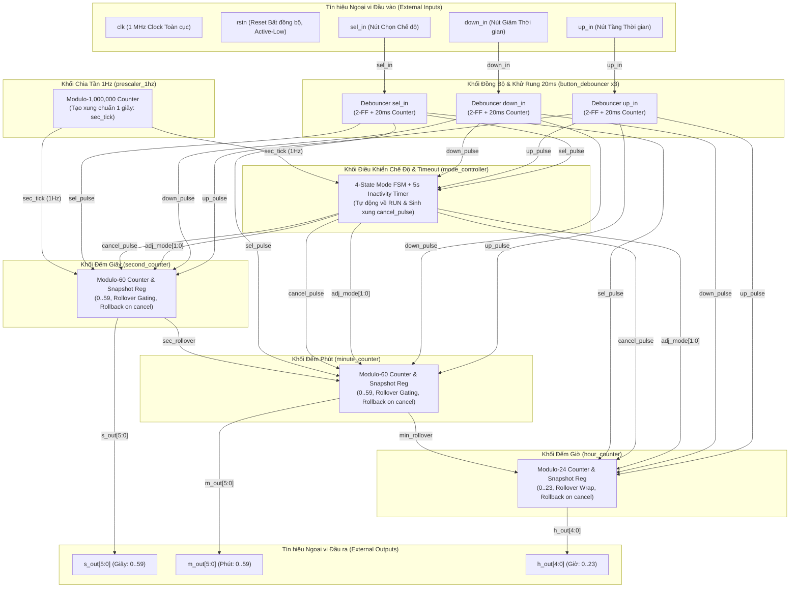

# ĐẶC TẢ THIẾT KẾ KIẾN TRÚC RTL
# BỘ ĐẾM THỜI GIAN GIỜ - PHÚT - GIÂY (HOUR-MINUTE-SECOND TIMER)
## IP CORE: `hms_timer` (Phiên bản v1.1.0: Hỗ trợ Debouncer 20ms & Auto-Cancel Timeout 5s)

---

## THÔNG TIN TÀI LIỆU
- **Tên dự án:** Thiết kế lõi IP Bộ đếm Thời gian Giờ - Phút - Giây (`hms_timer`)
- **Tài liệu tham chiếu:** `week1_Qorvo-HMS_Timer.pdf` (Qorvo Digital Design and Verification)
- **Mã tài liệu:** `SPEC-RTL-HMS-001`
- **Vai trò:** Kỹ sư Trưởng Kiến trúc RTL (Senior Digital IC / RTL Specification Architect)
- **Chuẩn ngôn ngữ:** IEEE 1364-2001 / IEEE 1800 Synthesizable Verilog / SystemVerilog
- **Mục tiêu công nghệ:** Technology-Independent (ASIC Standard Cell / FPGA Xilinx, Intel, Microchip)
- **Trạng thái:** `APPROVED FOR RTL IMPLEMENTATION`
- **Phiên bản:** `1.1.0`
- **Ngày phát hành:** 2026-09-23

---

## MỤC LỤC
1. [CHƯƠNG 1: TỔNG QUAN HỆ THỐNG VÀ KIẾN TRÚC THIẾT KẾ](#chương-1-tổng-quan-hệ-thống-và-kiến-trúc-thiết-kế)
   - 1.1 Tổng quan về thiết kế
   - 1.2 Đặc điểm kiến trúc cốt lõi
   - 1.3 Sơ đồ kiến trúc tổng quan (Architecture Overview)
   - 1.4 Bảng tham số kiến trúc (Design Parameters)
2. [CHƯƠNG 2: TOP MODULE – `hms_timer`](#chương-2-top-module--hms_timer)
   - 2.1 Sơ đồ khối Top Module
   - 2.2 Bảng chân tín hiệu ngoại vi Top Module (External I/O Table)
   - 2.3 Nguyên lý hoạt động tổng thể & Mối quan hệ tương tác giữa các Sub-module
   - 2.4 Bảng kết nối nội bộ giữa các Sub-module (Internal Interconnect Table)
   - 2.5 Giản đồ thời gian tổng thể Top Module (Top-Level Timing Diagram)
3. [CHƯƠNG 3: ĐẶC TẢ CHI TIẾT TỪNG SUB-MODULE](#chương-3-đặc-tả-chi-tiết-từng-sub-module)
   - 3.1 Module: `button_debouncer` (Khối Đồng bộ hóa & Khử rung phím 20ms)
   - 3.2 Module: `prescaler_1hz` (Khối Bộ chia tần số tạo xung 1Hz)
   - 3.3 Module: `mode_controller` (Khối Điều khiển Chế độ & FSM Timeout 5s)
   - 3.4 Module: `second_counter` (Khối Bộ đếm Giây Modulo-60 & Snapshot Rollback)
   - 3.5 Module: `minute_counter` (Khối Bộ đếm Phút Modulo-60 & Snapshot Rollback)
   - 3.6 Module: `hour_counter` (Khối Bộ đếm Giờ Modulo-24 & Snapshot Rollback)
4. [CHƯƠNG 4: MA TRẬN TRUY XUẤT YÊU CẦU (RTM) & KẾ HOẠCH KIỂM CHỨNG](#chương-4-ma-trận-truy-xuất-yêu-cầu-rtm--kế-hoạch-kiểm-chứng)
   - 4.1 Phân loại yêu cầu thiết kế (Requirement Classification)
   - 4.2 Ma trận truy xuất yêu cầu kiểm tra (Requirement Traceability Matrix - RTM)
   - 4.3 Kế hoạch kiểm chứng chức năng (Functional Verification Plan)

---

# CHƯƠNG 1: TỔNG QUAN HỆ THỐNG VÀ KIẾN TRÚC THIẾT KẾ

## 1.1 Tổng quan về thiết kế
Hệ thống **Hour-Minute-Second Timer** (`hms_timer`) là một khối IP phần cứng số hoàn chỉnh (Synthesizable RTL IP Core), hoạt động trên một miền xung nhịp đồng bộ duy nhất với tần số đầu vào chuẩn **$1\text{ MHz}$** ($f_{clk} = 1,000,000\text{ Hz}$, chu kỳ $T_{clk} = 1\,\mu\text{s}$) và tín hiệu Reset bất đồng bộ tích cực mức thấp (`rstn`).

Thiết kế cung cấp các chức năng chính:
1. **Chế độ đếm thời gian thực (Real-Time Counting Mode):** Tự động đếm tăng Giờ ($0 \dots 23$), Phút ($0 \dots 59$), Giây ($0 \dots 59$) theo nhịp thời gian thực chuẩn $1\text{ giây}$ được tạo từ khối chia tần `prescaler_1hz`.
2. **Chế độ điều chỉnh thời gian (Time Adjustment Mode):** Cho phép người dùng lựa chọn điều chỉnh từng trường thời gian (Giây, Phút, Giờ) qua nút chọn `sel_in`, và tăng/giảm giá trị qua 2 nút `up_in` và `down_in`.
3. **Khử rung nút bấm chuyên dụng 20ms (`20ms Button Debouncing & Auto-Repeat`):** Nút bấm cần được giữ liên tục trong $20\text{ ms}$ mới được công nhận là một lần nhấn hợp lệ. Nếu tiếp tục giữ, hệ thống tự động tính lại $20\text{ ms}$ từ đầu để tạo xung lặp lại chu kỳ. Nếu có rung động nhả phím trước $20\text{ ms}$, bộ đếm rung bị reset về 0 (loại bỏ glitch/noise).
4. **Hủy thay đổi & Tự động quay về Mode Run sau 5 giây không thao tác (`5s Inactivity Timeout & Rollback`):** Khi ở bất kỳ chế độ chỉnh sửa nào (`ADJ_SEC`, `ADJ_MIN`, `ADJ_HOUR`), nếu trong suốt $5\text{ giây}$ liên tục người dùng không thao tác phím bấm, hệ thống sẽ tự động hủy bỏ các chỉnh sửa chưa lưu (khôi phục lại snapshot thời gian lúc bắt đầu chỉnh) và chuyển FSM quay trở lại `MODE_RUN`.

## 1.2 Đặc điểm kiến trúc cốt lõi
- **Miền xung nhịp đơn đồng bộ (`Single Synchronous Clock Domain`):** Toàn bộ các thanh ghi (D-FF) trong hệ thống đều được kích hoạt tại sườn dương của xung nhịp `clk` (`posedge clk`). Tuyệt đối không sử dụng ngõ ra của bộ đếm trước làm xung nhịp cho bộ đếm sau (No Ripple Clock).
- **Chống hiện tượng không ổn định trạng thái & Khử rung (`Metastability Immunity & 20ms Debouncing`):** Các tín hiệu điều khiển ngoại vi (`sel_in`, `up_in`, `down_in`) được đưa qua chuỗi 2 tầng Flip-Flop đồng bộ kết hợp bộ đếm định thời $20\text{ ms}$ để lọc bỏ hoàn toàn rung phím cơ khí và trích xuất xung đơn kỳ 1-clock-cycle.
- **Lan truyền cờ tràn đồng bộ (`Synchronous Rollover Enable Propagation`):** Các bộ đếm liên kết với nhau bằng tín hiệu cho phép có độ rộng chính xác 1 chu kỳ xung nhịp (`sec_rollover`, `min_rollover`).
- **Khối FSM chuyển chế độ tuần hoàn 4 trạng thái có Timeout 5s:** `RUN_NORMAL (00)` $\rightarrow$ `ADJ_SEC (01)` $\rightarrow$ `ADJ_MIN (10)` $\rightarrow$ `ADJ_HOUR (11)` $\rightarrow$ `RUN_NORMAL (00)` kèm nhánh Timeout $5\text{s}$ quay về `RUN_NORMAL (00)`.
- **Hỗ trợ Wrap-around 2 chiều độc lập:**
  * Giây: $0 \rightarrow 1 \dots 59 \rightarrow 0$ (khi Tăng), $0 \rightarrow 59 \dots 1 \rightarrow 0$ (khi Giảm).
  * Phút: $0 \rightarrow 1 \dots 59 \rightarrow 0$ (khi Tăng), $0 \rightarrow 59 \dots 1 \rightarrow 0$ (khi Giảm).
  * Giờ: $0 \rightarrow 1 \dots 23 \rightarrow 0$ (khi Tăng), $0 \rightarrow 23 \dots 1 \rightarrow 0$ (khi Giảm).
- **Cách ly tràn khi đang điều chỉnh (`Rollover Gating during Adjustment`):** Khi đang ở chế độ chỉnh Giây hoặc chỉnh Phút bằng nút bấm, tín hiệu cờ tràn sang tầng kế tiếp bị khóa về mức `0`.
- **Cơ chế Snapshot & Rollback An toàn:** Tự động chốt giá trị thời gian khi bắt đầu chuyển từ `RUN` sang `ADJ_SEC`. Nếu bị Timeout $5\text{s}$, hệ thống phục hồi lại snapshot ban đầu; nếu hoàn thành chu trình bằng nút `SEL`, thời gian mới được xác nhận (Commit).

## 1.3 Sơ đồ kiến trúc tổng quan (Architecture Overview)



---

## 1.4 Bảng tham số kiến trúc (Design Parameters)

| Tên tham số | Giá trị mặc định | Đơn vị | Mô tả chức năng | Phân loại |
| :--- | :---: | :---: | :--- | :---: |
| `CLK_FREQ_HZ` | `1_000_000` | Hz | Tần số xung nhịp hệ thống đầu vào ($1\text{ MHz}$) | USER-PROVIDED |
| `PSC_COUNT_MAX` | `CLK_FREQ_HZ - 1` | Chu kỳ | Giá trị đếm cực đại của Prescaler ($10^6 - 1$) để tạo nhịp $1\text{ Hz}$ | DERIVED |
| `PSC_WIDTH` | `20` | Bit | Độ rộng bit thanh ghi đếm Prescaler ($\lceil\log_2(1_000_000)\rceil = 20$) | DERIVED |
| `DEBOUNCE_TIME_MS` | `20` | ms | Thời gian giữ nút tối thiểu để tính 1 lần nhấn | USER-PROVIDED |
| `DEBOUNCE_CYCLES` | `(CLK_FREQ_HZ / 1000) * DEBOUNCE_TIME_MS` | Chu kỳ | Số chu kỳ clock tương ứng thời gian khử rung ($20,000$ chu kỳ) | DERIVED |
| `DEBOUNCE_WIDTH` | `15` | Bit | Độ rộng thanh ghi đếm khử rung ($\lceil\log_2(20,000)\rceil = 15$) | DERIVED |
| `TIMEOUT_SEC` | `5` | Giây | Thời gian chờ không thao tác để tự động hủy thay đổi và thoát về RUN | USER-PROVIDED |
| `SEC_WIDTH` | `6` | Bit | Độ rộng thanh ghi đếm Giây ($0 \dots 59$) | USER-PROVIDED |
| `MIN_WIDTH` | `6` | Bit | Độ rộng thanh ghi đếm Phút ($0 \dots 59$) | USER-PROVIDED |
| `HOUR_WIDTH` | `5` | Bit | Độ rộng thanh ghi đếm Giờ ($0 \dots 23$) | USER-PROVIDED |
| `MODE_WIDTH` | `2` | Bit | Độ rộng trạng thái FSM điều khiển chế độ | DERIVED |

---

# CHƯƠNG 2: TOP MODULE – `hms_timer`

## 2.1 Sơ đồ khối Top Module

```
+=======================================================================================================+
|                                           TOP: hms_timer                                              |
|                                                                                                       |
|                     +----------------------------------------------------+                            |
|                     |                  button_debouncer                  |                            |
|   sel_in ---------->| [2-FF + 20ms Counter + Auto-repeat] -> sel_pulse -+|-------+                    |
|   up_in ----------->| [2-FF + 20ms Counter + Auto-repeat] -> up_pulse --+|----+  |                    |
|   down_in --------->| [2-FF + 20ms Counter + Auto-repeat] -> down_pulse -+|--+ |  |                    |
|                     +----------------------------------------------------+  | |  |                    |
|                                                                             | |  |                    |
|                     +-------------------------------+                       | |  |                    |
|                     |        mode_controller        |                       | |  |                    |
|                     | (FSM 4 States + 5s Timer)     |<----------------------+ |  |                    |
|                     | cancel_pulse -----------------|----+                    |  |                    |
|                     | adj_mode[1:0] ----------------|--+ |                    |  |                    |
|                     +---------------+---------------+  | |                    |  |                    |
|                                     ^                  | |                    |  |                    |
|                     +---------------+-----+            | |                    |  |                    |
|                     |    prescaler_1hz    |            | |                    |  |                    |
|                     | sec_tick -----------|---+        | |                    |  |                    |
|                     +---------------------+   |        | |                    |  |                    |
|                                               |        | |                    |  |                    |
|                     +---------------------+   |        | |                    |  |                    |
|                     |   second_counter    |   |        | |                    |  |                    |
|                     | (Mod-60 + Snapshot) |<--+<-------+<+<-------------------+--+                    |
|                     | s_out[5:0] ---------|---|--------|-|----------------------------> s_out[5:0]    |
|                     | sec_rollover -------|---|---+    | |                                            |
|                     +---------------------+   |   |    | |                                            |
|                                               |   |    | |                                            |
|                     +---------------------+   |   |    | |                                            |
|                     |   minute_counter    |   |   |    | |                                            |
|                     | (Mod-60 + Snapshot) |<--+   |<---+<+<-------------------+--+                    |
|                     | m_out[5:0] ---------|---|---|----|-|----------------------------> m_out[5:0]    |
|                     | min_rollover -------|---|---|----+ |                                            |
|                     +---------------------+   |   |    | |                                            |
|                                               |   |    | |                                            |
|                     +---------------------+   |   |    | |                                            |
|                     |    hour_counter     |   |   |    | |                                            |
|                     | (Mod-24 + Snapshot) |<--+   |    |<+<-------------------+--+                    |
|                     | h_out[4:0] ---------|---|---|----|-|----------------------------> h_out[4:0]    |
|                     +---------------------+   |   |    | |                                            |
|                                                                                                       |
|   clk -------------> [Đưa đến tất cả các sub-module trên miền xung nhịp 1 MHz]                        |
|   rstn ------------> [Đưa đến tất cả các sub-module reset bất đồng bộ tích cực thấp]                  |
+=======================================================================================================+
```

## 2.2 Bảng chân tín hiệu ngoại vi Top Module (External I/O Table)

| Tên chân tín hiệu | Hướng | Số bit | Loại | Mô tả chức năng chi tiết | Điều kiện hợp lệ | Giá trị Reset (`rstn=0`) | Phân loại |
| :--- | :---: | :---: | :---: | :--- | :--- | :---: | :---: |
| `clk` | Input | 1 | Clock | Xung nhịp hệ thống toàn cục tần số $1\text{ MHz}$ | Chu kỳ ổn định $1\,\mu\text{s}$ | N/A | USER-PROVIDED |
| `rstn` | Input | 1 | Reset | Tín hiệu khởi tạo hệ thống (Bất đồng bộ, tích cực mức thấp - Active-Low) | Mức `0` để reset toàn bộ hệ thống | N/A | USER-PROVIDED |
| `sel_in` | Input | 1 | Control | Nút chọn chế độ (Cần giữ ổn định $20\text{ ms}$) | Mức logic `1` khi nhấn | N/A | USER-PROVIDED |
| `up_in` | Input | 1 | Control | Nút tăng giá trị (Cần giữ ổn định $20\text{ ms}$, hỗ trợ auto-repeat) | Mức logic `1` khi nhấn | N/A | USER-PROVIDED |
| `down_in` | Input | 1 | Control | Nút giảm giá trị (Cần giữ ổn định $20\text{ ms}$, hỗ trợ auto-repeat) | Mức logic `1` khi nhấn | N/A | USER-PROVIDED |
| `h_out` | Output | 5 | Data | Giá trị Giờ thời gian thực hiện tại ($0 \dots 23$) | $0 \le \text{h\_out} \le 23$ | `5'b00000` (`0`) | USER-PROVIDED |
| `m_out` | Output | 6 | Data | Giá trị Phút thời gian thực hiện tại ($0 \dots 59$) | $0 \le \text{m\_out} \le 59$ | `6'b000000` (`0`) | USER-PROVIDED |
| `s_out` | Output | 6 | Data | Giá trị Giây thời gian thực hiện tại ($0 \dots 59$) | $0 \le \text{s\_out} \le 59$ | `6'b000000` (`0`) | USER-PROVIDED |

---

## 2.3 Nguyên lý hoạt động tổng thể & Tương tác Sub-module

### 2.3.1 Cơ chế phân tầng và tương tác tín hiệu
1. **Khối khử rung & bắt xung (`button_debouncer`):**
   - Lọc 3 tín hiệu ngoại vi `sel_in`, `up_in`, `down_in` qua 2 tầng D-FF đồng bộ và bộ đếm $20\text{ ms}$ ($20,000$ cycles tại $1\text{ MHz}$).
   - Chỉ khi tín hiệu giữ liên tục ở mức `1` đủ $20\text{ ms}$, mạch mới phát ra xung tích cực 1 chu kỳ (`sel_pulse`, `up_pulse`, `down_pulse`).
   - Nếu tiếp tục giữ phím, bộ đếm đếm lại $20\text{ ms}$ từ đầu để tự động lặp lại (Auto-repeat).
   - Nếu phím bị nhả trước $20\text{ ms}$, bộ đếm rung bị xóa về `0` ngay lập tức.
2. **Khối tạo nhịp chuẩn 1 giây (`prescaler_1hz`):**
   - Bộ đếm modulo-1,000,000 tạo xung `sec_tick` định kỳ $1\text{ Hz}$. Xung này cấp đồng thời cho bộ đếm giây `second_counter` và bộ đếm timeout của `mode_controller`.
3. **Khối FSM & Inactivity Timeout 5s (`mode_controller`):**
   - Quản lý 4 trạng thái FSM (`RUN`, `ADJ_SEC`, `ADJ_MIN`, `ADJ_HOUR`).
   - Khi ở trạng thái `RUN`: Bộ đếm timeout bị xóa về 0. Khi có `sel_pulse`, chuyển sang `ADJ_SEC`.
   - Khi ở các trạng thái `ADJ_*`:
     - Nếu có bất kỳ nút nào được bấm (`sel_pulse || up_pulse || down_pulse`), bộ đếm timeout bị reset về 0 (gia hạn thêm $5\text{s}$).
     - Nếu nhận đủ 5 xung `sec_tick` liên tiếp mà không có nút nào bấm: FSM tự động nhảy về `RUN`, đồng thời phát xung `cancel_pulse = 1` trong 1 chu kỳ.
     - Nếu người dùng bấm `sel_pulse` tại `ADJ_HOUR`, FSM quay về `RUN` bình thường và xác nhận lưu thời gian mới (Commit).
4. **Khối các bộ đếm thời gian (`second_counter`, `minute_counter`, `hour_counter`):**
   - **Lưu Snapshot:** Khi đang ở `MODE_RUN` mà nhận được `sel_pulse` (chuyển sang `ADJ_SEC`), cả 3 bộ đếm tự động lưu giá trị hiện tại vào thanh ghi Snapshot (`r_sec_bak`, `r_min_bak`, `r_hour_bak`).
   - **Rollback on Timeout:** Khi nhận được `cancel_pulse = 1` từ `mode_controller`, cả 3 bộ đếm lập tức nạp lại giá trị từ thanh ghi Snapshot, loại bỏ toàn bộ các thay đổi chưa được xác nhận.
   - **Đếm thời gian thực & Điều chỉnh:** Thực hiện đếm modulo $60/60/24$, cách ly cờ tràn trong chế độ chỉnh giờ, và xử lý wrap-around 2 chiều.

---

## 2.4 Bảng kết nối nội bộ giữa các Sub-module (Internal Interconnect Table)

| Tên Net nội bộ | Bit-width | Module Nguồn (Driver) | Module Đích (Receiver) | Mô tả chức năng |
| :--- | :---: | :--- | :--- | :--- |
| `sel_pulse` | 1 | `u_debouncer_sel` | `mode_controller`, các counter | Xung tích cực 1 chu kỳ khi giữ `sel_in` đủ $20\text{ ms}$ |
| `up_pulse` | 1 | `u_debouncer_up` | `mode_controller`, các counter | Xung tích cực 1 chu kỳ khi giữ `up_in` đủ $20\text{ ms}$ |
| `down_pulse` | 1 | `u_debouncer_down` | `mode_controller`, các counter | Xung tích cực 1 chu kỳ khi giữ `down_in` đủ $20\text{ ms}$ |
| `sec_tick` | 1 | `prescaler_1hz` | `second_counter`, `mode_controller` | Xung chuẩn nhịp $1\text{ Hz}$ (độ rộng 1 cycle clock) |
| `adj_mode[1:0]` | 2 | `mode_controller` | `second_counter`, `minute_counter`, `hour_counter` | Mã trạng thái chế độ hoạt động hiện tại |
| `cancel_pulse` | 1 | `mode_controller` | `second_counter`, `minute_counter`, `hour_counter` | Xung tích cực 1 chu kỳ kích hoạt hủy thay đổi (Rollback) |
| `sec_rollover` | 1 | `second_counter` | `minute_counter` | Xung tràn Giây (59->0) cho phép tăng Phút |
| `min_rollover` | 1 | `minute_counter` | `hour_counter` | Xung tràn Phút (59->0) cho phép tăng Giờ |

---

## 2.5 Giản đồ thời gian tổng thể Top Module (Top-Level Timing Diagram)

### Giản đồ 2.5.1: Hoạt động của Button Debouncer 20ms & Auto-Repeat
```
Thời gian      : 0ms       5ms      10ms     20ms     25ms     40ms     45ms
                 _____________________________        __________________
btn_in (thô)   :_| ||||||| |_________________|        |                 |___
                 (Rung phím)
                            __________________        __________________
btn_sync (2-FF):___________|                  |______|                  |___
                 -----------------------------------------------------------
cnt            : 0000000000 000001 -> 19999    000000 000001 -> 19999   0000
                                               __                        __
btn_pulse      :______________________________|  |______________________|  |
                                              (Pulse 1)                 (Auto-Repeat)
```

### Giản đồ 2.5.2: Hoạt động Inactivity Timeout 5s & Rollback Hủy Thay Đổi
```
Thời gian      : T0       T1 (Bấm SEL)   T2 (Bấm UP)    T_sec1  T_sec2  T_sec3  T_sec4  T_sec5 (Timeout)
                 __       __             __
sel_pulse      :_| |_____|  |___________|  |_______________________________________________________
up_pulse       :________________________|  |_______________________________________________________
adj_mode[1:0]  : 2'b00 (RUN) | 2'b01 (ADJ_SEC)                                      | 2'b00 (RUN)
                 ----------------------------------------------------------------------------------
s_out[5:0]     : 6'd10       | 6'd10 (Snapshot=10) | 6'd11  | 6'd11 | 6'd11 | 6'd11 | 6'd10 (Reverted)
sec_tick (1Hz) :____________________________________|  |_____|  |_____|  |_____|  |_____|  |_________
timeout_cnt    : 0           | 0        | 0         | 1      | 2     | 3     | 4     | 0 (Timeout!)
                                                                                         __
cancel_pulse   :________________________________________________________________________|  |_______
```

---

# CHƯƠNG 3: ĐẶC TẢ CHI TIẾT TỪNG SUB-MODULE

## 3.1 Module: `button_debouncer`

### 3.1.1 Sơ đồ khối (Block Diagram)

```
                    +-------------------------------------------------------------+
                    |                      button_debouncer                       |
                    |                                                             |
                    |   +--------------------+     +--------------------------+   |
   btn_in --------->|-->| 2-Stage D-FF Sync  |---->| Debounce Counter 20ms    |   |
                    |   | (Metastability)    |     | (cnt == DEBOUNCE_LIMIT)  |   |
                    |   +--------------------+     +------------+-------------+   |
                    |                                           |                 |
                    |                                           v                 |
                    |                                     btn_pulse (1-cycle) ----|---> btn_pulse
                    |                                                             |
   clk ------------>| [Xung nhịp 1 MHz]                                           |
   rstn ----------->| [Reset bất đồng bộ tích cực thấp]                           |
                    +-------------------------------------------------------------+
```

### 3.1.2 Bảng chân tín hiệu (I/O Interface Table)

| Tên chân tín hiệu | Hướng | Số bit | Loại | Mô tả chức năng chi tiết | Điều kiện hợp lệ | Giá trị Reset (`rstn=0`) |
| :--- | :---: | :---: | :---: | :--- | :--- | :---: |
| `clk` | Input | 1 | Clock | Xung nhịp hệ thống $1\text{ MHz}$ | Chuẩn | N/A |
| `rstn` | Input | 1 | Reset | Reset hệ thống bất đồng bộ tích cực thấp | Mức `0` | N/A |
| `btn_in` | Input | 1 | Async In | Tín hiệu nút nhấn bất đồng bộ từ ngoại vi | Active-High | N/A |
| `btn_pulse` | Output | 1 | Pulse Out | Xung tích cực 1 chu kỳ sau khi giữ đủ $20\text{ ms}$ | Đồng bộ `clk` | `1'b0` |

### 3.1.3 Nguyên lý hoạt động (Operating Principle)
- **Đồng bộ hóa 2 tầng FF:**
  $$sync\_reg[1:0] \leftarrow \{sync\_reg[0], btn\_in\}$$
  Tín hiệu `btn_sync = sync_reg[1]` là tín hiệu đã loại bỏ metastability.
- **Bộ đếm thời gian giữ $20\text{ ms}$ (`timer_cnt`):**
  - Nếu `btn_sync == 1`:
    - Nếu $timer\_cnt == \text{DEBOUNCE\_CYCLES} - 1$:
      - Phát xung `btn_pulse = 1`.
      - Reset $timer\_cnt \leftarrow 0$ để **tính lại $20\text{ ms}$ từ đầu** (hỗ trợ auto-repeat khi giữ nút).
    - Ngược lại: $timer\_cnt \leftarrow timer\_cnt + 1$, `btn_pulse = 0`.
  - Nếu `btn_sync == 0`:
    - $timer\_cnt \leftarrow 0$, `btn_pulse = 0` (xóa bộ đếm khi nhả nút hoặc khi có rung phím).

---

## 3.2 Module: `prescaler_1hz`

### 3.2.1 Sơ đồ khối (Block Diagram)

```
                    +-------------------------------------------------------------+
                    |                        prescaler_1hz                        |
                    |                                                             |
                    |   +-----------------------------------------------------+   |
                    |   | Thanh ghi đếm 20-bit: r_count[19:0]                 |   |
                    |   |                                                     |   |
                    |   | r_count == PSC_COUNT_MAX ? 0 : r_count + 1          |   |
                    |   +--------------------------+--------------------------+   |
                    |                              |                              |
                    |                              v                              |
                    |                  [So sánh r_count == PSC_COUNT_MAX]         |
                    |                              |                              |
                    |                              v                              |
                    |                          sec_tick (Độ rộng 1 cycle) --------|---> sec_tick
                    |                                                             |
   clk ------------>| [Xung nhịp 1 MHz]                                           |
   rstn ----------->| [Reset bất đồng bộ tích cực thấp]                           |
                    +-------------------------------------------------------------+
```

### 3.2.2 Bảng chân tín hiệu (I/O Interface Table)

| Tên chân tín hiệu | Hướng | Số bit | Loại | Mô tả chức năng chi tiết | Điều kiện hợp lệ | Giá trị Reset (`rstn=0`) |
| :--- | :---: | :---: | :---: | :--- | :--- | :---: |
| `clk` | Input | 1 | Clock | Xung nhịp hệ thống $1\text{ MHz}$ | Chuẩn | N/A |
| `rstn` | Input | 1 | Reset | Reset hệ thống bất đồng bộ tích cực thấp | Mức `0` | N/A |
| `sec_tick` | Output | 1 | Pulse Out | Xung nhịp tích cực mức cao độ rộng 1 chu kỳ mỗi khi đủ 1 giây | Đồng bộ `clk` | `1'b0` |

---

## 3.3 Module: `mode_controller`

### 3.3.1 Sơ đồ khối (Block Diagram)

```
                    +-------------------------------------------------------------+
                    |                       mode_controller                       |
                    |                                                             |
                    |   +--------------------+     +--------------------------+   |
   sel_pulse ------>|-->| FSM 4 Trạng Thái   |---->| adj_mode[1:0]            |---|---> adj_mode[1:0]
   up_pulse ------->|-->| RUN / ADJ_SEC /    |     +--------------------------+   |
   down_pulse ----->|-->| ADJ_MIN / ADJ_HOUR |     +--------------------------+   |
   sec_tick ------->|-->|                    |---->| Inactivity Timeout (5s)  |   |
                    |   +--------------------+     | -> cancel_pulse (1-cycle)|---|---> cancel_pulse
                    |                              +--------------------------+   |
   clk ------------>| [Xung nhịp 1 MHz]                                           |
   rstn ----------->| [Reset bất đồng bộ tích cực thấp]                           |
                    +-------------------------------------------------------------+
```

### 3.3.2 Bảng chân tín hiệu (I/O Interface Table)

| Tên chân tín hiệu | Hướng | Số bit | Loại | Mô tả chức năng chi tiết | Điều kiện hợp lệ | Giá trị Reset (`rstn=0`) |
| :--- | :---: | :---: | :---: | :--- | :--- | :---: |
| `clk` | Input | 1 | Clock | Xung nhịp hệ thống $1\text{ MHz}$ | Chuẩn | N/A |
| `rstn` | Input | 1 | Reset | Reset hệ thống bất đồng bộ tích cực thấp | Mức `0` | N/A |
| `sel_pulse` | Input | 1 | Pulse In | Xung nhấn nút chọn chế độ sau debounce | 1 cycle | N/A |
| `up_pulse` | Input | 1 | Pulse In | Xung nhấn nút tăng sau debounce | 1 cycle | N/A |
| `down_pulse` | Input | 1 | Pulse In | Xung nhấn nút giảm sau debounce | 1 cycle | N/A |
| `sec_tick` | Input | 1 | Pulse In | Xung chuẩn nhịp $1\text{ Hz}$ từ Prescaler | 1 cycle | N/A |
| `adj_mode` | Output | 2 | State Out | Mã trạng thái chế độ hoạt động hiện tại | `2'b00, 2'b01, 2'b10, 2'b11` | `2'b00` (`MODE_RUN`) |
| `cancel_pulse` | Output | 1 | Pulse Out | Xung báo hủy thay đổi khi hết $5\text{s}$ timeout | 1 cycle | `1'b0` |

### 3.3.3 Bảng chuyển trạng thái FSM kết hợp Timeout 5s

| Trạng thái hiện tại | Sự kiện kích hoạt | Trạng thái kế tiếp | `cancel_pulse` | Hành động hệ thống |
| :---: | :--- | :---: | :---: | :--- |
| `MODE_RUN (2'b00)` | `sel_pulse == 1` | `MODE_ADJ_SEC (2'b01)` | `0` | Chuyển sang chỉnh Giây, chốt snapshot |
| `MODE_RUN (2'b00)` | Các sự kiện khác | `MODE_RUN (2'b00)` | `0` | Đếm thời gian thực bình thường |
| `MODE_ADJ_SEC (2'b01)` | `sel_pulse == 1` | `MODE_ADJ_MIN (2'b10)` | `0` | Chuyển sang chỉnh Phút, reset timeout |
| `MODE_ADJ_SEC (2'b01)` | `up_pulse \| down_pulse` | `MODE_ADJ_SEC (2'b01)` | `0` | Chỉnh giá trị giây, reset timeout về 0 |
| `MODE_ADJ_SEC (2'b01)` | Timeout 5s không thao tác | `MODE_RUN (2'b00)` | `1` | **Hủy thay đổi, Rollback về snapshot, về RUN** |
| `MODE_ADJ_MIN (2'b10)` | `sel_pulse == 1` | `MODE_ADJ_HOUR (2'b11)` | `0` | Chuyển sang chỉnh Giờ, reset timeout |
| `MODE_ADJ_MIN (2'b10)` | `up_pulse \| down_pulse` | `MODE_ADJ_MIN (2'b10)` | `0` | Chỉnh giá trị phút, reset timeout về 0 |
| `MODE_ADJ_MIN (2'b10)` | Timeout 5s không thao tác | `MODE_RUN (2'b00)` | `1` | **Hủy thay đổi, Rollback về snapshot, về RUN** |
| `MODE_ADJ_HOUR (2'b11)`| `sel_pulse == 1` | `MODE_RUN (2'b00)` | `0` | **Xác nhận lưu (Commit), chuyển về RUN** |
| `MODE_ADJ_HOUR (2'b11)`| `up_pulse \| down_pulse` | `MODE_ADJ_HOUR (2'b11)` | `0` | Chỉnh giá trị giờ, reset timeout về 0 |
| `MODE_ADJ_HOUR (2'b11)`| Timeout 5s không thao tác | `MODE_RUN (2'b00)` | `1` | **Hủy thay đổi, Rollback về snapshot, về RUN** |

---

## 3.4 Module: `second_counter`

### 3.4.1 Bảng chân tín hiệu bổ sung

| Tên chân tín hiệu | Hướng | Số bit | Loại | Mô tả chức năng chi tiết | Giá trị Reset (`rstn=0`) |
| :--- | :---: | :---: | :---: | :--- | :---: |
| `clk` | Input | 1 | Clock | Xung nhịp hệ thống $1\text{ MHz}$ | N/A |
| `rstn` | Input | 1 | Reset | Reset bất đồng bộ tích cực thấp | N/A |
| `adj_mode` | Input | 2 | Control | Trạng thái chế độ từ `mode_controller` | N/A |
| `sec_tick` | Input | 1 | Pulse In | Xung $1\text{ Hz}$ từ Prescaler | N/A |
| `sel_pulse` | Input | 1 | Pulse In | Xung nhấn `sel_in` (Dùng để chốt Snapshot khi vào chỉnh sửa) | N/A |
| `up_pulse` | Input | 1 | Pulse In | Xung tăng giây | N/A |
| `down_pulse` | Input | 1 | Pulse In | Xung giảm giây | N/A |
| `cancel_pulse` | Input | 1 | Pulse In | Xung yêu cầu hủy thay đổi và rollback | N/A |
| `s_out` | Output | 6 | Data Out | Giá trị Giây hiện tại ($0 \dots 59$) | `6'd0` |
| `sec_rollover` | Output | 1 | Pulse Out | Xung tràn Giây sang Phút (chỉ tích cực ở `MODE_RUN`) | `1'b0` |

### 3.4.2 Nguyên lý Snapshot & Rollback
1. **Lưu Snapshot (`r_sec_bak`):**
   - Khi `(adj_mode == MODE_RUN) && (sel_pulse == 1)`:
     $$r\_sec\_bak \leftarrow r\_sec$$
2. **Rollback khi Timeout (`cancel_pulse == 1`):**
   - Khi `cancel_pulse == 1`:
     $$r\_sec \leftarrow r\_sec\_bak$$
3. **Đếm thời gian & Điều chỉnh bình thường:** Khi `cancel_pulse == 0`, thực hiện đếm modulo 60 hoặc tăng/giảm wrap-around.

---

## 3.5 Module: `minute_counter`

### 3.5.1 Bảng chân tín hiệu bổ sung

| Tên chân tín hiệu | Hướng | Số bit | Loại | Mô tả chức năng chi tiết | Giá trị Reset (`rstn=0`) |
| :--- | :---: | :---: | :---: | :--- | :---: |
| `clk` | Input | 1 | Clock | Xung nhịp hệ thống $1\text{ MHz}$ | N/A |
| `rstn` | Input | 1 | Reset | Reset bất đồng bộ tích cực thấp | N/A |
| `adj_mode` | Input | 2 | Control | Trạng thái chế độ từ `mode_controller` | N/A |
| `sec_rollover` | Input | 1 | Pulse In | Xung tràn từ `second_counter` | N/A |
| `sel_pulse` | Input | 1 | Pulse In | Xung nhấn `sel_in` (Dùng để chốt Snapshot) | N/A |
| `up_pulse` | Input | 1 | Pulse In | Xung tăng phút | N/A |
| `down_pulse` | Input | 1 | Pulse In | Xung giảm phút | N/A |
| `cancel_pulse` | Input | 1 | Pulse In | Xung yêu cầu hủy thay đổi và rollback | N/A |
| `m_out` | Output | 6 | Data Out | Giá trị Phút hiện tại ($0 \dots 59$) | `6'd0` |
| `min_rollover` | Output | 1 | Pulse Out | Xung tràn Phút sang Giờ (chỉ tích cực ở `MODE_RUN`) | `1'b0` |

### 3.5.2 Nguyên lý Snapshot & Rollback
- Tương tự như `second_counter`, thanh ghi `r_min_bak` lưu giá trị phút lúc bắt đầu vào chế độ chỉnh sửa. Nếu có `cancel_pulse = 1`, nạp lại $r\_min \leftarrow r\_min\_bak$.

---

## 3.6 Module: `hour_counter`

### 3.6.1 Bảng chân tín hiệu bổ sung

| Tên chân tín hiệu | Hướng | Số bit | Loại | Mô tả chức năng chi tiết | Giá trị Reset (`rstn=0`) |
| :--- | :---: | :---: | :---: | :--- | :---: |
| `clk` | Input | 1 | Clock | Xung nhịp hệ thống $1\text{ MHz}$ | N/A |
| `rstn` | Input | 1 | Reset | Reset bất đồng bộ tích cực thấp | N/A |
| `adj_mode` | Input | 2 | Control | Trạng thái chế độ từ `mode_controller` | N/A |
| `min_rollover` | Input | 1 | Pulse In | Xung tràn từ `minute_counter` | N/A |
| `sel_pulse` | Input | 1 | Pulse In | Xung nhấn `sel_in` (Dùng để chốt Snapshot) | N/A |
| `up_pulse` | Input | 1 | Pulse In | Xung tăng giờ | N/A |
| `down_pulse` | Input | 1 | Pulse In | Xung giảm giờ | N/A |
| `cancel_pulse` | Input | 1 | Pulse In | Xung yêu cầu hủy thay đổi và rollback | N/A |
| `h_out` | Output | 5 | Data Out | Giá trị Giờ hiện tại ($0 \dots 23$) | `5'd0` |

### 3.6.2 Nguyên lý Snapshot & Rollback
- Thanh ghi `r_hour_bak` lưu giá trị giờ lúc bắt đầu vào chế độ chỉnh sửa. Nếu có `cancel_pulse = 1`, nạp lại $r\_hour \leftarrow r\_hour\_bak$.

---

# CHƯƠNG 4: MA TRẬN TRUY XUẤT YÊU CẦU (RTM) & KẾ HOẠCH KIỂM CHỨNG

## 4.1 Phân loại yêu cầu thiết kế (Requirement Classification)

| Mã yêu cầu | Mô tả yêu cầu | Nguồn gốc | Đánh giá kiến trúc |
| :--- | :--- | :---: | :--- |
| `REQ-HMS-001` | Thiết kế bộ đếm thời gian Giờ - Phút - Giây chuẩn | `USER-PROVIDED` | Cần 3 bộ đếm độc lập Modulo-24, 60, 60 |
| `REQ-HMS-002` | Ngõ ra thời gian thực: `h_out[4:0]`, `m_out[5:0]`, `s_out[5:0]` | `USER-PROVIDED` | Khớp chuẩn bit-width: Giờ (5b), Phút (6b), Giây (6b) |
| `REQ-HMS-003` | Điều chỉnh thời gian qua các tín hiệu `Select`, `Up`, `Down` | `USER-PROVIDED` | Cần FSM điều khiển 4 trạng thái |
| `REQ-HMS-004` | Xung nhịp đầu vào $1\text{ MHz}$ và reset bất đồng bộ tích cực thấp (`rstn`) | `USER-PROVIDED` | Prescaler $10^6$ chu kỳ cho nhịp $1\text{ Hz}$ |
| `REQ-HMS-005` | Xử lý Wrap-around 2 chiều Up ($59\to 0, 23\to 0$) và Down ($0\to 59, 0\to 23$) | `DERIVED` | Thiết kế logic cộng/trừ có điều kiện ngưỡng |
| `REQ-HMS-006` | Cô lập cờ tràn (rollover) khi đang chỉnh giờ | `DERIVED` | Gating `sec_rollover` và `min_rollover` về 0 khi ở Adjust Mode |
| `REQ-HMS-007` | Chống tranh chấp nút nhấn đồng thời (`up_pulse` & `down_pulse`) | `RECOMMENDED` | Giữ nguyên giá trị khi cả 2 nút cùng tích cực |
| `REQ-HMS-008` | **Khử rung phím 20ms & Auto-Repeat:** Giữ nút $20\text{ ms}$ mới tính 1 lần, đếm lại từ đầu | `USER-PROVIDED` | Tích hợp bộ đếm định thời $20\text{ ms}$ trong `button_debouncer` |
| `REQ-HMS-009` | **Timeout 5s & Rollback Hủy Thay Đổi:** Treo ở mode chỉnh $5\text{s}$ không thao tác thì hủy và về RUN | `USER-PROVIDED` | FSM Timeout Timer + Snapshot/Rollback Registers |

---

## 4.2 Ma trận truy xuất yêu cầu kiểm tra (Requirement Traceability Matrix - RTM)

| Mã yêu cầu | Mô tả chi tiết | Module phụ trách | Cơ chế kiểm chứng | Mục tiêu Coverage |
| :--- | :--- | :--- | :--- | :---: |
| `REQ-HMS-001` | Đếm chuẩn Giờ/Phút/Giây | Các counter | `test_normal_run_rollover` | 100% Line, Toggle |
| `REQ-HMS-002` | Dải giá trị ngõ ra | Top `hms_timer` | SVA Assertions ($s \le 59, m \le 59, h \le 23$) | 100% Assertions |
| `REQ-HMS-003` | FSM chuyển mode 4 trạng thái | `mode_controller` | `test_fsm_mode_cycle` | 100% FSM State/Trans |
| `REQ-HMS-004` | Chia tần 1MHz sang 1Hz | `prescaler_1hz` | `test_prescaler_timing` | 100% Functional |
| `REQ-HMS-005` | Wrap-around 2 chiều | Các counter | `test_adjust_wrap_up_down` | 100% Corner case |
| `REQ-HMS-006` | Khóa tràn khi chỉnh giờ | Các counter | `test_adjust_isolation` | 100% Isolation |
| `REQ-HMS-007` | Xử lý nhấn đồng thời Up/Down | Các counter | `test_simultaneous_up_down` | 100% Corner case |
| `REQ-HMS-008` | **Khử rung 20ms & Auto-repeat** | `button_debouncer` | `test_button_debounce_and_glitch`: Bơm nhiễu <20ms (bị bỏ qua), giữ >20ms (nhận 1 pulse), giữ >40ms (nhận 2 pulses) | 100% Branch & Functional |
| `REQ-HMS-009` | **Timeout 5s & Rollback** | `mode_controller`, các counter | `test_inactivity_timeout_rollback`: Chỉnh dở dang giờ/phút/giây, chờ $5\text{s}$, kiểm tra FSM về `RUN` và dữ liệu phục hồi nguyên vẹn | 100% State, Functional |

---

## 4.3 Kế hoạch kiểm chứng chức năng (Functional Verification Plan)

### Danh mục các bài Test Case:
1. `tc_reset_recovery`: Kiểm tra Reset bất đồng bộ tích cực thấp.
2. `tc_prescaler_accuracy`: Kiểm tra độ chính xác chu kỳ $1\text{ Hz}$ của Prescaler.
3. `tc_normal_count_cascade`: Kiểm tra đếm tiến liên hoàn Giây $\to$ Phút $\to$ Giờ.
4. `tc_mode_navigation_commit`: Duyệt vòng tròn các mode và xác nhận lưu thời gian khi quay về RUN qua nút SEL.
5. `tc_button_debounce_glitch_filter`: Bơm xung nhiễu ngắn (< 20ms) để xác nhận không bị kích hoạt ngoài ý muốn.
6. `tc_button_debounce_hold_repeat`: Nhấn giữ liên tục 20ms, 40ms, 60ms để xác nhận phát xung nhịp nhàng và đếm lại từ đầu.
7. `tc_adjust_up_down_wrap`: Chỉnh tăng/giảm tại các mode với wrap-around.
8. `tc_adjust_cross_isolation`: Khóa cờ tràn trong khi chỉnh giờ.
9. `tc_simultaneous_up_down`: Xung đột nhấn đồng thời cả 2 nút Up và Down.
10. `tc_inactivity_timeout_rollback`: Treo ở mode `ADJ_SEC`, `ADJ_MIN`, `ADJ_HOUR` quá $5\text{s}$ không thao tác, kiểm tra FSM tự về `RUN` và thời gian được hoàn tác về snapshot ban đầu.
11. `tc_inactivity_timeout_keepalive`: Thao tác phím trước khi hết $5\text{s}$ để kiểm tra timeout được reset và gia hạn đúng quy định.

---
**TÀI LIỆU ĐẶC TẢ SPECIFICATION V1.1.0 ĐÃ HOÀN TẤT VÀ ĐẠT TIÊU CHUẨN ĐỂ TIẾN HÀNH HIỆN THỰC HÓA MÃ NGUỒN RTL.**
