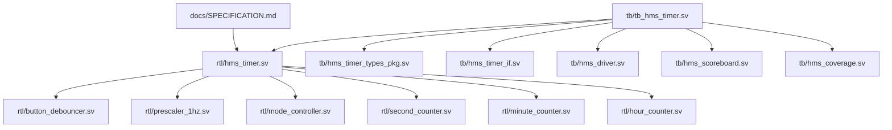

# Repository Map & Architecture Mapping (v1.1.0)

## 1. Directory Structure

```text
HMS_Timer/
├── README.md                      # Overview, build instructions, test scorecard
├── Makefile                       # QuestaSim / VCS / Verilator build automation
├── repo_map.md                    # Repository mapping & traceability
├── rtl_hierarchy.md               # RTL Module hierarchy & port mapping
├── design_intent.md               # Architectural decisions & rationale
├── common_failures.md             # Common bugs and debugging playbook
├── debug_checklist.md             # Pre-commit & sign-off checklist
├── docs/
│   └── SPECIFICATION.md           # Formal Top-down Architectural Specification (v1.1.0)
├── rtl/
│   ├── button_debouncer.sv        # 2-FF sync + 20ms debounce counter & auto-repeat
│   ├── prescaler_1hz.sv           # 1 MHz -> 1 Hz timebase prescaler
│   ├── mode_controller.sv         # 4-State Mode FSM with 5s Inactivity Timeout
│   ├── second_counter.sv          # Modulo-60 Second Counter with +/-1 adjustment & Snapshot Rollback
│   ├── minute_counter.sv          # Modulo-60 Minute Counter with +/-1 adjustment & Snapshot Rollback
│   ├── hour_counter.sv            # Modulo-24 Hour Counter with +/-1 adjustment & Snapshot Rollback
│   └── hms_timer.sv               # Top-Level IP Core Integration
└── tb/
    ├── hms_timer_types_pkg.sv     # Enums, structs, transaction classes, logging
    ├── hms_timer_if.sv            # SystemVerilog Interface with Clocking Blocks & SVA
    ├── hms_driver.sv              # Driver class for stimulus & reset
    ├── hms_scoreboard.sv          # Cycle-accurate Scoreboard & Golden Model
    ├── hms_coverage.sv            # Covergroups for FSM, Time values & Crosses
    └── tb_hms_timer.sv            # Main testbench runner executing automated test cases
```

## 2. File Responsibilities & Inter-dependencies


